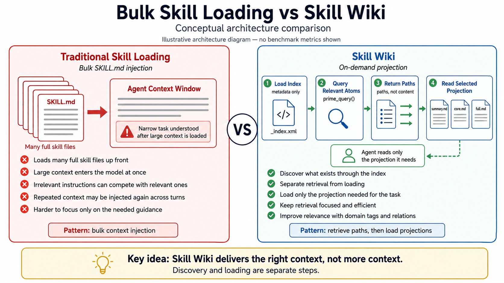

# Skill Wiki — Comparison with Alternative Approaches

[English](./comparison.md) · [中文](./zh-CN/comparison.md)

This document compares Skill Wiki against five architectural patterns for feeding
domain knowledge to LLM agents. The goal is honest positioning, not marketing.
Where Skill Wiki loses, we say so.



The picture above is the core distinction: bulk-loading dumps entire skill files into the agent's context window; Skill Wiki keeps an index always present and loads only the selected projection on demand.

---

## The five patterns

| Pattern | Core idea |
|---|---|
| **Eager-injection skills** | Markdown files loaded in full as system prompt on every turn |
| **Skill Wiki** | Typed atoms, edge graph, lazy projection via an indexed corpus |
| **Embedding-retrieval RAG** | Chunks embedded in a vector store; top-k retrieved per query |
| **Typed knowledge graphs** | Ontology-backed RDF/property-graph stores with SPARQL-style query |
| **Package-manager corpora** | Versioned bundles published to a registry and installed declaratively |

---

## Feature comparison

| Feature | Eager-injection skills | Skill Wiki | Embedding-retrieval RAG | Typed knowledge graphs | Package-manager corpora |
|---|---|---|---|---|---|
| **Typed knowledge kinds** | No — free-form prose | Yes — 28 kinds, schema-enforced | No — opaque chunks | Yes — ontology classes | Partial — manifest metadata only |
| **Typed edge relationships** | No — flat list at best | Yes — 14 verbs, first-class | No — hyperlinks only | Yes — predicates | No |
| **Compile-time validation** | No | Yes — L1 structural + L3 graph; L2 semantic optional | No | Partial — schema validators exist but rarely enforced per-chunk | No |
| **Lazy / progressive loading** | No — full content always | Yes — summary · core · full projection | Partial — top-k retrieved, but chunks are all-or-nothing | No — query returns full nodes | No — install is all-or-nothing |
| **Semver + content-addressed IDs** | No | Yes — per-atom semver + content hash | No | No | Yes — package-level semver |
| **Composable contracts** | No | Yes — `must-include` / `must-avoid` per persona | No | Partial — OWL constraints, rarely used in practice | No |
| **Conflict detection** | No — agent confusion at runtime | Yes — `contradicts` and `conflicts` edges; L3 checks | No | Partial — OWL `owl:disjointWith`, tooling-dependent | No |
| **Cross-LLM portability** | Provider-dependent | Yes — no LLM in the retrieval path; L2 is opt-in | Embedding-model-dependent | Yes | Yes |
| **Offline / no-network retrieval** | Yes — files are local | Yes — compiled corpus is filesystem-only | Requires vector DB | Requires graph DB | After install, yes |
| **Explainable retrieval ranking** | N/A (no retrieval) | Yes — each score axis is inspectable | No — cosine similarity is opaque | Partial — query plan visible | N/A |
| **GPU / embedding infrastructure** | None | None | Required | None | None |
| **Authoring overhead** | Low — write markdown | Medium — learn the DSL | Low — write prose, chunk it | High — model the ontology | Medium — write manifests + content |

---

## Per-pattern takeaway

### Eager-injection skills

The simplest possible approach. Write markdown, load it as system prompt. Zero
infrastructure. Works well when the skill set is small (under ~10 skills) and
the tasks are homogeneous enough that all loaded knowledge is relevant.

The failure mode is **context pollution**: as the skill set grows, any given
turn loads knowledge irrelevant to it. Irrelevant prose doesn't just waste
tokens — it demonstrably degrades model judgment on the actual task. Our
benchmark showed a 13-point quality drop when a creation-oriented skill set was
loaded for a review-oriented task. This isn't a model bug; it's an architectural
consequence of eager injection.

Eager injection has no coordination primitive. Two skills can contradict each
other; there is no mechanism to detect or signal this. The agent sees both and
must resolve the conflict in context — inconsistently.

**Use when:** you have fewer than ~10 skills and task types are stable.

---

### Skill Wiki

Skill Wiki's bet is that domain knowledge has structure worth encoding. A `fact`
is not a `rule` is not a `pattern`. A `requires` edge means something different
from a `contradicts` edge. Encoding that structure unlocks compile-time
validation, graph traversal, conflict detection, and the projection model that
makes lazy loading tractable.

The tradeoff is **authoring overhead**: contributors learn a DSL. The payoff is
that the corpus becomes queryable, validatable, and versionable — rather than
a pile of prose only humans can navigate.

The projection model (summary / core / full) is the key mechanism: the agent
always knows what exists (~3 KB index), but loads content only when retrieval
selects it. Token budget is proportional to task relevance, not corpus size.

**Weaknesses acknowledged below.**

---

### Embedding-retrieval RAG

RAG is the dominant industry pattern for knowledge retrieval. Its strengths are
real: zero authoring overhead beyond writing prose, scales to millions of chunks,
retrieves across domains the author never anticipated, and is model-agnostic at
the query level.

The fundamental limitation is that retrieval is **opaque**. Cosine similarity on
embeddings cannot be inspected, biased, or reasoned about. There is no concept
of "this chunk is a rule that must not coexist with that chunk" — the retriever
doesn't know what a rule is. Conflict detection, composition contracts, and
edge-traversal are all architecturally absent.

RAG also retrieves independently of knowledge structure: a `fact` and an
`anti-pattern` that share keywords score the same. Kind-aware boosting (e.g.,
prefer personas over checks for a design-generation task) requires a hybrid
architecture that adds significant complexity.

Embedding retrieval is also infrastructure-heavy: requires a vector database,
embedding model, and GPU budget for large corpora.

**Use when:** the corpus is large (>100k chunks), unstructured prose dominates,
and conflict detection / typed relationships are not requirements.

---

### Typed knowledge graphs

Ontology-backed stores (RDF, property graphs, OWL) are the most semantically
rich option. Typed nodes, typed predicates, formal subsumption, SPARQL or
Cypher queries, reasoning engines — the full apparatus of knowledge engineering.

The practical barriers are high. Ontology modeling requires specialist expertise.
Query languages are not LLM-native. Loading graph results into an LLM context
requires a serialization layer that most teams write ad hoc. Progressive
disclosure — the idea that an agent should see existence before content — is not
a concept in standard graph databases.

For AI agent consumption specifically, typed knowledge graphs are
over-engineered on the schema axis and under-engineered on the
retrieval-for-LLM axis. They are the right tool for enterprise knowledge
management, regulatory ontologies, and cross-system data integration. They are
not designed for the "~3 KB index, then lazy-load atoms" consumption pattern.

**Use when:** you need formal reasoning over a large ontology, cross-system
interoperability (e.g., SPARQL federation), or compliance traceability.

---

### Package-manager corpora

Treat knowledge bundles like npm packages: semantic versioning, a registry,
declarative install, conflict resolution at the bundle level. This solves the
distribution and dependency management problem that eager-injection completely
ignores.

The gap is that versioning and distribution are a **coordination layer**, not a
**retrieval or validation layer**. A package of markdown skills, once installed,
still needs to be loaded somehow — and the loading problem is unsolved. Package
managers don't give you typed atoms, typed edges, projection levels, or
compile-time validation of the content inside the package.

Skill Wiki's registry component (`prime publish` / `prime install`) is, in fact,
a package-manager layer over a typed-atom corpus. You get both.

**Use when:** distribution, versioning, and team-level dependency management are
the primary pain points, and content structure is secondary.

---

## "When to use Skill Wiki" decision tree

```
Does your knowledge corpus have more than ~20 units
and more than ~3 task types?
│
├─ No  →  Eager-injection skills are fine. Don't over-engineer.
│
└─ Yes
    │
    Does retrieval need to be explainable / auditable?
    │
    ├─ No, and corpus is mostly unstructured prose, >50k chunks
    │    →  Embedding-retrieval RAG. Add Skill Wiki later if
    │       conflict detection becomes a pain point.
    │
    └─ Yes, or corpus is structured domain knowledge (<~20k atoms)
        │
        Do you need formal reasoning, OWL entailment,
        or cross-system SPARQL federation?
        │
        ├─ Yes  →  Typed knowledge graph. Consider a Skill Wiki
        │           adapter for the LLM consumption layer.
        │
        └─ No
            │
            Is distribution / versioning across teams
            the primary pain point?
            │
            ├─ Yes, and content structure is secondary
            │    →  Package-manager corpora.
            │       (Skill Wiki's registry covers this too
            │        once you need typed atoms.)
            │
            └─ No — you need typed knowledge, lazy loading,
                       conflict detection, and composable contracts
                 →  Skill Wiki.
```

---

## Honest weaknesses of Skill Wiki

These are not future roadmap items dressed up as caveats. They are real
limitations at the time of this writing (v0.1.0).

**1. Untested cross-LLM at scale.**
All internal benchmarks were run on a single model. The retrieval path (index
read → atom load) is model-agnostic by design, but the L2 semantic checker and
intent classifier have not been validated against other providers. Claims about
cross-LLM portability are architectural, not empirically verified.

**2. Single-language DSL.**
The `.prime` DSL is the only authoring surface. Contributors must learn it.
There is no YAML import, no JSON schema ingestion, no prose-to-atom conversion
pipeline (though the `prime-decompose` Skill in the corpus repo helps
interactively). If your team cannot absorb the DSL, Skill Wiki is not yet
practical for you.

**3. No GPU embedding retrieval.**
Retrieval is purely symbolic: keyword overlap × kind boost × edge traversal ×
domain match × quality score. This is fast and explainable, but it cannot do
semantic similarity across paraphrase. A query using terminology not present in
any atom's text will miss relevant atoms. Embedding-based retrieval is pluggable
in the future but not present in v1.

**4. Single-corpus maturity.**
The only production-proven corpus is the frontend-design corpus (899 atoms). The
`recipes` and `coding-style` examples demonstrate the protocol on other domains,
but no large-scale corpus outside frontend design has gone through a full authoring +
A/B testing + fix cycle. Whether the 28 kinds and 14 verbs remain ergonomic at
scale in other domains is unverified.

**5. Scale ceiling.**
The in-memory `_index.xml` index works well up to approximately 10,000 atoms.
Beyond that, the index itself may strain context budgets. Sharding (multiple
sub-indexes by domain or namespace) is the intended mitigation but is not
implemented in v0.1.0.

**6. L2 semantic checker is experimental.**
The optional per-atom LLM semantic check (gated by `DEEPSEEK_API_KEY`) has no
regression suite in CI. It works in practice; its accuracy claims are
illustrative, not benchmarked.

---

## Summary positioning

Skill Wiki occupies a specific niche: **structured domain knowledge,
compile-time quality guarantees, lazy retrieval, composable contracts, at the
scale of a team or an organization** — not a document corpus of millions of
chunks, not a formal ontology requiring reasoning engines.

If that description matches your problem, Skill Wiki is designed for you.
If it doesn't, one of the other patterns above is probably the right fit.

---

*Skill Wiki v0.1.0 · Apache-2.0 · [Back to docs](../README.md#documentation)*
