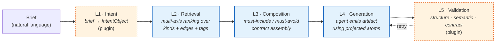
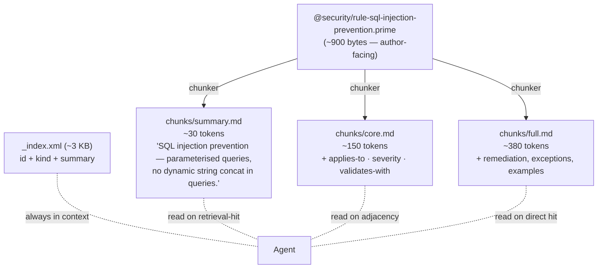
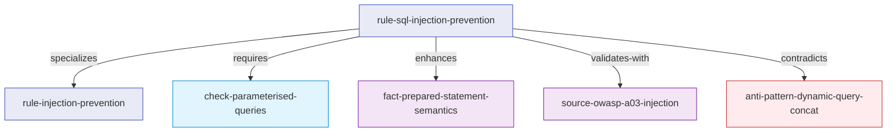
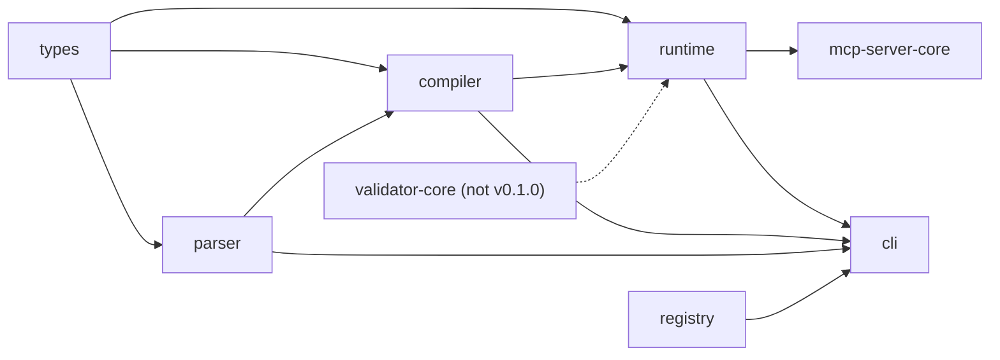

# Architecture

> Skill Wiki / Prime, layer by layer. 7 packages, from parser to MCP server.
> How a brief becomes an output, and where every typed atom lives along the way.

[← back to README](../../README.md) · [Philosophy](./philosophy.md) · [Getting started](../getting-started.md) · [DSL quick reference](../reference/dsl-quickref.md)

---


The full picture: 8 layers from agent brief to model providers, with cross-cutting concerns (lifecycle, governance, license, domain extension) on the right.

---

## The five-layer pipeline

A turn through Skill Wiki has exactly five layers. Three are protocol —
universal, frozen at v1. Two are pluggable — domain-specific.



### L1 — Intent classification *(plugin layer)*

The brief is free-form prose. L1 turns it into a structured
`IntentObject` whose shape is **domain-defined** — the protocol only
specifies that L1 must produce a serialisable object that downstream
layers can read. Each corpus defines its own intent fields.

For example, a security-policy corpus might produce:

```typescript
// Example (security domain): corpus-defined IntentObject shape
interface SecurityIntentObject {
  task_type: string;         // "threat-model" | "compliance-check" | "code-review" | ...
  target_surface: string;    // "api-endpoint" | "auth-flow" | "data-pipeline" | ...
  severity_threshold: "low" | "medium" | "high" | "critical";
  required_frameworks: string[];  // ["owasp-top10", "nist-csf", ...]
  ambiguity_flags: string[];
}
```

The frontend-design corpus uses a different shape — `task_type:
"marketing-landing"`, `motion_priority`, `density`, etc. — documented
in [`spec/FRONTEND-DESIGN-DOMAIN-v1.md §1`](../../spec/FRONTEND-DESIGN-DOMAIN-v1.md).
Neither shape is the protocol; both are domain-level decisions.

This is the only layer where natural-language nuance leaks into the pipeline.
Everything downstream operates on the structured object.

The generic `mcp-server-core` ships without any L1 implementation — it
accepts raw queries directly. Domain wrappers (like the frontend corpus's
5-tool MCP) add L1 on top. If `DEEPSEEK_API_KEY` is set, a small-LLM
classifier runs; otherwise L1 falls back to keyword heuristics.

### L2 — Multi-axis retrieval *(protocol)*

Retrieval is structured, not vector-similarity. **Axes are
domain-defined** — the protocol provides the scoring engine; each corpus
declares its own axis set in `domain.yaml`.

Example: the frontend-design corpus declares six axes (`register`,
`pattern`, `motion`, `typography`, `color`, `rules`). A security corpus
might declare four (`auth`, `inputs`, `secrets`, `audit`). A recipes
corpus might declare four (`technique`, `cuisine`, `equipment`, `time`).
The protocol does not know what any axis name means — it only knows: an
axis is a named ranker that returns atom IDs.

*(The six frontend-design axes are documented in full in
[`spec/FRONTEND-DESIGN-DOMAIN-v1.md §2`](../../spec/FRONTEND-DESIGN-DOMAIN-v1.md).)*

Ranking inside an axis is a 5-layer cascade tuned to keep typed knowledge
robust under noisy briefs:

| Layer | Signal |
|---|---|
| 1 | Token overlap on `id` + `description` |
| 2 | Topic synonym (cross-language: "排版" / "typography" / "字体" all map to the same topic) |
| 3 | Kind boost — configurable per corpus via `AOE_KIND_BOOSTS` env var or `domain.yaml` |
| 4 | Topic-kind affinity — domain plugin maps topics to preferred kinds |
| 5 | Direct hit on intent — L1 IntentObject fields boost matching atoms |

A bare cosine-similarity ranker would return atoms whose embedded prose
happens to share words with the brief. Skill Wiki's ranker can explain
why every choice was made — kind boost, topic mapping, direct hit. That
explainability is a *consequence* of typing knowledge.

### L3 — Composition contract *(protocol)*

After retrieval picks ~10–20 candidate atoms, L3 enforces the contracts
declared by selected atoms that carry a `composition:` block. The
**protocol defines two universal contract fields**: `must-include` and
`must-avoid`. Domain corpora may add typed sub-fields (see
[`spec/FRONTEND-DESIGN-DOMAIN-v1.md §3`](../../spec/FRONTEND-DESIGN-DOMAIN-v1.md)
for the frontend-domain extensions such as `typography-required` and
`motion-prescriptions`).

A generic example (from `examples/recipes/`):

```prime
persona MichelinFineDining {
  id: "@recipes/persona-michelin-fine-dining"
  version: "1.0.0"

  composition: {
    must-include: [
      @recipes/rule-mise-en-place,
      @recipes/rule-acid-balance,
      @recipes/check-plating-discipline,
    ]
    must-avoid: [
      @recipes/persona-comfort-food,
      @recipes/anti-pattern-overgarnishing,
    ]
  }
}
```

The compositor walks the must-include and must-avoid sets and rewrites
the candidate list. If the brief picked `persona-michelin-fine-dining`
AND `persona-comfort-food` — they conflict — L3 fails the contract and
surfaces the conflict.

This is the type system for knowledge composition. Free-form prose can
contain any internal contradiction; a contract-checked composition
cannot.

### L4 — Generation *(plugin layer)*

Generation is whatever the agent does. Skill Wiki produces an *atom plan*
— "load these atom IDs at these projection levels, must-include these,
must-avoid these" — and hands the plan to the agent. The agent calls
`Read` on the chunk paths it needs, then writes the artifact.

L4 is the layer Skill Wiki *least* controls. The protocol provides the
inputs (typed atoms, contract, projection levels). The agent does the writing.

### L5 — Output validation *(plugin layer)*

After generation, the artifact is validated by the domain's L5 plugin.
The protocol defines three sub-layer slots; the validation logic is
domain-specific:

| Sub-layer | What (protocol slot) | Frontend-domain example | Security-domain example |
|---|---|---|---|
| `l1-structure` | Parse output for structural integrity | ARIA labels; heading hierarchy | Policy fields present; severity declared |
| `l2-semantic` | LLM-backed aesthetic / semantic fit | "Does this match the requested register?" | "Does this cover the stated threat surface?" |
| `l3-composition` | Were must-include atoms reflected? Any must-avoid atoms present? | Contract check on persona constraints | Contract check on framework constraints |

On failure, the validator emits a structured retry prompt that names the
violated atoms and contracts. The agent regenerates with the prompt
appended. Maximum two retry cycles before surfacing failure.

> **Why "L5" and not "L4"?** L1, L2, L3 are compile-time validators
> (parser, semantic, cross-atom graph). L4 is the agent. L5 is the runtime
> output validator. The naming is consistent: L-prefix means "validation
> layer N." Generation has no L number.

---

## The projection model

Every atom compiles to three projection levels. The agent never sees the
full source; it sees an index of *existence*, then pulls projections by
ID.



The chunker (`packages/compiler/src/chunker.ts`) walks the AST and emits
three Markdown files per atom:

```typescript
// packages/compiler/src/chunker.ts (signature)
export interface ChunkLevels {
  /** ~30 tok: description + tags + 1-line claim */
  summary: string;
  /** ~150 tok: + core body fields */
  core: string;
  /** ~380 tok: + sources + examples + relations + notes */
  full: string;
}
```

What goes in which level is kind-aware:

| Kind | Summary level | Core level | Full level |
|---|---|---|---|
| `rule` | The claim | + applies-when, severity | + remediation, exceptions |
| `pattern` | Problem statement | + solution + structure | + examples, behaviors |
| `fact` | Statement | + confidence + applies-to | + sources, counter-conditions |
| `persona` | One-line posture description | + `composition.{must-include, must-avoid}` + domain-specific implies fields | + examples, notes |

The agent picks its level. The runtime resolves it. Token budget moves
from "load everything" to "load exactly the projection this turn requires."

This is the most consequential design decision in the system. See
[philosophy.md](./philosophy.md#why-projection-not-injection) for the why.

---

## The edge graph

Edges are typed. They are not magic strings — the parser knows each
verb's semantics, and the L3 cross-atom checker reasons over them.



The 14 verbs form three semantic families:

**Loading-discipline verbs** — control what enters the agent's context:
- `requires` — A loaded ⇒ B MUST load
- `enhances` — A loaded ⇒ B improves output but is optional
- `conflicts` — never load both
- `compatible` — explicitly OK to load both
- `includes` — collection lists members

**Type-system verbs** — describe how atoms relate as types:
- `specializes` — narrower subtype
- `extends` — inherits all fields, overrides specified
- `derived-from` — non-inheriting derivative

**Semantic verbs** — describe truth-relationships:
- `contradicts` — opposing claims (L3 flag)
- `validates-with` — A's correctness verified against B
- `supplies-to` — A provides values consumed by B
- `related` / `see-also` — discoverable association
- `relationships` — legacy catch-all

This typing makes the retriever smart and the validator strict. A bare
"related" hyperlink can be anything; `validates-with` means: when an
atom claims `validates-with @w3c/wcag-2.2-1.4.3`, the L3 checker
*confirms the target exists and is itself valid*.

The frontend-design corpus (in `prime-corpus-frontend`, 899 atoms)
compiles to ~3,096 edges, averaging ~4.2 edges per atom. The most
common verb is `related` (~88% of edges), then `compatible`, `conflicts`,
`validates-with`, `includes`. These numbers are specific to that corpus;
a security or recipes corpus will show different ratios depending on how
heavily it uses `validates-with` (source-heavy domains) vs `requires`
(procedural-step-heavy domains).

See [DSL quick reference](../reference/dsl-quickref.md#the-14-edge-verbs) for the
full per-verb table with allowed source/target kind pairs.

---

## Compile-time vs runtime separation

Skill Wiki has two distinct phases. They share types but never talk to
each other directly.

### Compile time (`packages/compiler/`)

Inputs: `.prime` source files (author-facing).


Pipeline:

```
sources/*.prime
    ↓ packages/parser/  (lex + parse)
    ↓ checker-l1.ts     (schema + required fields + reference resolution)
    ↓ checker-l3.ts     (cycle detection · cross-atom contradiction)
    ↓ checker-l2.ts     (optional — small-LLM semantic check, $0.0001/atom)
    ↓ chunker.ts        (split into summary/core/full per atom)
    ↓ atom-dir-emitter  (one directory per atom — chunks/ + atom.yaml + graph.yaml)
    ↓ global-index-emitter  (_index.xml — the always-in-context index)
compiled/
```

L1 is mandatory. L3 is mandatory. L2 is optional and gracefully skipped
when no API key is set — atoms are then assumed semantically valid by
their authors. L2 catches cases like an atom whose `description` claims
"low contrast" but whose `severity` is set to `low`, when the same atom's
`remediation` field describes a critical accessibility blocker. Cheap to
run, sometimes load-bearing.

### Runtime (`packages/runtime/`)

Inputs: `compiled/` directory.


The runtime has one rule: **never read chunk content**. It reads
`_index.xml` and per-atom `atom.yaml` (metadata only) to build the
in-memory graph. Chunk markdown stays on disk; the agent retrieves it
via its own `Read` tool when retrieval picks the atom.

```typescript
// packages/runtime/src/atom-loader.ts
//
// IMPORTANT: This module NEVER reads chunks/*.md content.
// It only reads _index.xml and atom.yaml (metadata).
// Chunk content is exclusively for the agent to pull via the Read tool.
```

This separation is what makes the system cheap. The runtime fits in
~3 KB of agent context regardless of corpus size; chunks live on disk
and only flow into context on demand.

---

## Domain plugin architecture

Skill Wiki itself ships as a *protocol* — 28 kinds, 14 verbs, 5 pipeline
layers. A *domain* (frontend-design, security, recipes, …) plugs into
the protocol via the DomainRegistry pattern.

```typescript
// packages/runtime/src/domain-plugin.ts
export interface DomainPlugin {
  /** Stable domain identifier, kebab-case (e.g. "frontend-design"). */
  readonly name: string;
  /** Canonical tag vocabulary — used for ranking and scope checks. */
  readonly tags: ReadonlyArray<string>;
  /** True if this prime belongs to the domain. */
  scopeCheck(ast: PrimeAST): boolean;
  /** Optional domain-specific L2 heuristics. */
  extraHeuristics?(ast: PrimeAST): DomainDiagnostic[];
}
```

A domain plugin contributes:

1. **A tag vocabulary.** "warm", "literary", "fintech" for frontend; "auth",
   "secrets", "audit" for security. The retriever biases ranking toward
   in-domain tags.
2. **A scope check.** Given a parsed atom, does it belong to this domain?
   Usually a tag check or namespace check.
3. **Extra heuristics.** Domain-specific L2 checks. The frontend-design
   plugin adds checks like "if persona declares `font.display` but not
   `font.body`, warn." Security might add "if `rule` declares severity
   `high` but no `validates-with`, warn."

Multiple domains can register simultaneously. Atoms outside any domain
remain queryable but unbiased.

The frontend-design corpus that ships in `prime-corpus-frontend` is
itself a domain plugin. Replacing it with your own is the unit of
extension. See [docs/corpus-authoring.md](../guides/corpus-authoring.md) for the
walkthrough.

---

## What's in each package

```
packages/
├── parser/           .prime DSL lexer + recursive-descent parser
├── types/            shared TS types (AtomKind, EdgeVerb, ProjectionLevel, AST nodes)
├── compiler/         L1/L2/L3 checkers, edge resolver, chunker, atom-dir emitter
├── runtime/          atom loader, projection resolver, domain plugin host
├── validator-core/   generic L1/L2/L3 output validation framework (not in v0.1.0)
├── registry/         HTTP package registry — publish / install
├── cli/              the `prime` command
└── mcp-server-core/  generic MCP server: prime_query over any compiled corpus
```

The dependency graph:



`types` is the protocol contract. Everything else depends on it. Nothing
depends on a sibling — the package graph is a tree, not a mesh. A new
generation (parser v2, compiler v2) can ship in isolation.

---

## The MCP server-core

`packages/mcp-server-core/` is a ~200-line generic MCP server. It exposes
exactly one tool over any compiled corpus:

```typescript
prime_query({
  scope: "atoms" | "related" | "graph" | "search",
  id?: string,
  query?: string,
  level?: "summary" | "core" | "full",
  depth?: number,
}) → AtomList | AtomDetail | AdjacencyList
```

It loads `compiled/_index.xml`, walks the graph in memory, and returns
atoms at the projection level you request. No domain knowledge is baked
in — every query is structural.

A domain corpus typically wraps this core with domain-aware tools. For
example, the frontend-design corpus exposes 5 tools (`prime_compile`,
`prime_intent`, `prime_query`, `prime_resolve`, `prime_validate`) and
adds intent classification and 6-axis retrieval. A security corpus might
expose a `policy_check` tool that runs compliance validators on a text
input. Those domain wrappers don't ship in the system repo — they live
with each domain corpus.

See [docs/mcp.md](../guides/mcp.md) for the protocol details.

---

## Performance properties

Three numbers worth knowing:

| Property | Value | Why |
|---|---|---|
| Build time | ~80 ms for 5-atom hello-world; ~10 s for 899-atom frontend corpus | Native TS strip on Node 22+; no transpilation; chunker is O(atoms × fields) |
| Index size | ~800 bytes / 5 atoms; ~3 KB / 1000 atoms | Index is `id + kind + summary` only — bytes scale linearly with count |
| Per-query work | O(log atoms) for ID lookup; O(neighbors) for graph traversal; O(atoms × axes) worst-case retrieval | All in-memory after `loadIndex` |

The agent's context never holds all atoms. It holds the index plus the
projections retrieval picked — typically 5–8 atoms at the level chosen
for each. For a 1000-atom corpus, that means <10 KB of atom content
loaded per turn versus ~400 KB for "load everything."

---

## Where to go next

- [Philosophy](./philosophy.md) — *why* the architecture has these shapes
- [Getting started](../getting-started.md) — boot the system end-to-end
- [DSL quick reference](../reference/dsl-quickref.md) — atom kinds and edge verbs in detail
- [Protocol Spec](../../spec/PRIME-PROTOCOL-v1.md) — v1 protocol grammar
- [Frontend Domain Spec](../../spec/FRONTEND-DESIGN-DOMAIN-v1.md) — frontend-design domain wrapper

---

*Architecture document v1.0 — if you find a divergence between this doc and the code, file a bug.*
