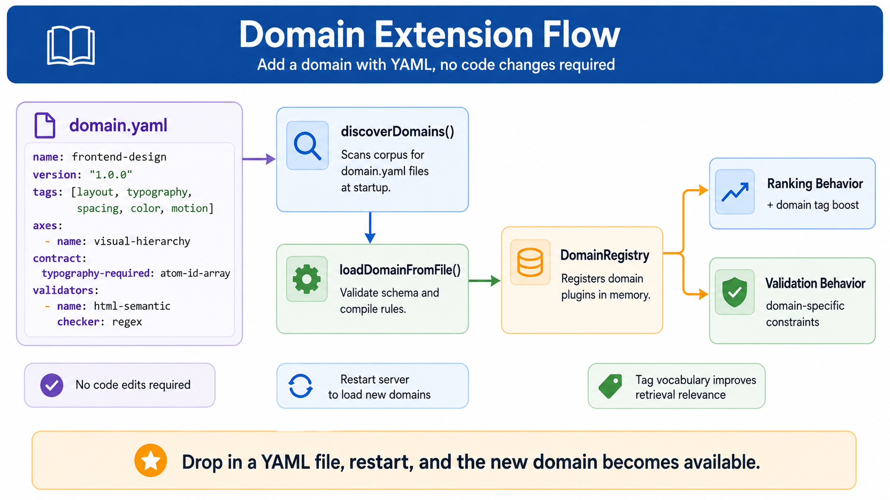

# Domain Extension Guide

Adding a new knowledge domain to Prime Wiki requires no TypeScript edits — drop a `domain.yaml` file alongside your corpus.

---

## Zero Built-in Domains

Prime Wiki ships **no hardcoded domains**. There is no `FRONTEND_DESIGN_DOMAIN` constant in the runtime. Every domain — including the ones bundled with `prime-corpus-frontend-design` — lives in a `domain.yaml` file.

This means your corpus's `domain.yaml` is a first-class citizen, not a second-class "user extension". The bundled domains (`frontend-design`, `security`, `accessibility`) use the exact same mechanism you use.

---

## Why Config-Driven?

Before the config-driven approach, adding a domain like `security`, `machine-learning`, or `cooking` required editing TypeScript source code, recompiling, and redeploying. Every team that maintained a non-frontend corpus had to fork the server.

The config-driven approach solves this with a single design principle: **a domain is a data file, not code**. You describe your domain in `domain.yaml` and the runtime loads it at startup. No fork. No compile step. No redeploy (restart is still required; dynamic hot-reload is planned for a future version).

---

## The Five-Minute Domain



The fastest way to add a domain is to copy an example and adapt it.

**Step 1.** Copy the example config:

```bash
cp examples/recipes/domain.yaml corpora/my-domain/domain.yaml
```

**Step 2.** Edit the three required fields:

```yaml
name: my-domain           # kebab-case, unique across your loaded domains
version: "1.0.0"
description: What this corpus covers in one sentence.
```

**Step 3.** Replace the `tags:` list with the words a user would naturally write when they want content from your domain:

```yaml
tags:
  - my-domain
  - main-concept
  - key-term
  - synonym-of-key-term
```

**Step 4.** Restart the MCP server (or `prime` CLI). Your domain is now registered:

```
[prime-wiki] config-driven domains loaded: my-domain
[prime-wiki] domain registry: my-domain
```

**Step 5.** Run a query to verify:

```bash
prime query "how do I do the main concept"
```

Atoms from your corpus should appear in the results, ranked by relevance to your domain.

> **Note:** The bundled `frontend-design` domain in the example log above only appears if you have also pointed your runtime at the `prime-corpus-frontend-design` domains directory. By default, only domains discovered in your current working directory are registered.

---

## How Discovery Works

At startup, `discoverDomains()` recursively walks the working directory (or `AOE_DOMAINS_DIR`) looking for any `domain.yaml` file, up to **4 directory levels deep** (`MAX_DISCOVERY_DEPTH = 4`). The `node_modules/` directory and hidden directories are skipped automatically.

```
Startup
  ↓
discoverDomains(rootDir)
  ↓
  Recursively walks rootDir (depth ≤ 4)
  Finds every domain.yaml (skips node_modules and hidden dirs)
  ↓
  For each file (lexicographic path order):
    parse YAML → validate schema → build DomainPlugin
    if name already seen: warn + skip (first-wins)
    else: add to list
  ↓
registerAll(registry, plugins)
  ↓
DomainRegistry now holds all config-loaded domains
  ↓
User sends query → MCP server
  ↓
detectBriefDomains(brief)
  iterates registry.names()
  for each domain: checks plugin.tags against brief text
  → returns Set<domainName>
  ↓
rankAtoms(atoms, briefDomains)
  atoms matching a briefDomain → score boost
  ↓
Ranked results returned to user
```

### Environment Variables

| Variable | Default | Description |
|----------|---------|-------------|
| `AOE_DOMAINS_DIR` | Current working directory | Override the corpus scan root. When set, only `*/domain.yaml` directly within this directory is scanned (one level, no recursion). |

Example:

```bash
AOE_DOMAINS_DIR=/teams/legal/corpora prime query "cite-style for judicial opinions"
```

---

## The Full Reference

### File Location

The `domain.yaml` file must be placed somewhere within your working directory tree, at most 4 levels deep:

```
corpora/<corpus-name>/domain.yaml        ← depth 2 (most common)
packages/<pkg>/src/domain.yaml           ← depth 3
```

The default scan root is the current working directory. Use `AOE_DOMAINS_DIR` to override.

---

### Required Fields

#### `name`

The stable identifier for your domain. Used as the key in the registry, in scope filters, and in atom `domain:` field matching.

- Type: string
- Format: kebab-case (`[a-z0-9-]+`), 1–64 characters
- Must be unique across all loaded domains in one process

```yaml
name: cooking
```

Do not use uppercase, underscores, or spaces. If two `domain.yaml` files declare the same `name`, the first one found (lexicographic path order) wins and the second is skipped with a warning.

#### `version`

The version of this domain config. Version your domain config like a package: increment `PATCH` for tag tweaks, `MINOR` for new optional fields, `MAJOR` for breaking changes.

- Type: string
- Format: Semantic version `MAJOR.MINOR.PATCH`

```yaml
version: "1.0.0"
```

Always quote the version in YAML to prevent the parser from stripping trailing zeros.

#### `description`

A one-sentence description of the domain. Shown in `prime domains --list` output and registry introspection.

- Type: string
- Length: 1–512 characters

```yaml
description: Domain plugin for cooking and culinary-technique corpora.
```

---

### Optional Fields

#### `tags`

The canonical tag vocabulary for your domain. Used in two ways:

1. **Brief scanning.** When a user's brief contains any word from your `tags` list, atoms in your domain receive a retrieval score boost.
2. **Scope checking.** An atom's `tags:` field is checked against this vocabulary to determine domain membership for heuristic runs.

- Type: string array
- Default: `[]` (empty — the domain is registered but never activated by brief scanning)
- Item format: Unicode letters/digits with optional hyphens; 1–64 characters
- Maximum: 200 tags

```yaml
tags:
  - cooking
  - recipe
  - bake
  - mise-en-place
```

**Unicode tags are supported.** Tags can contain any Unicode letters and digits (CJK, Japanese, Greek, Latin accented, etc.):

```yaml
tags:
  - 烹饪
  - cuisine
  - スケ
```

**Tag matching:**
- ASCII tags: matched case-insensitively (both sides lowercased).
- Non-ASCII tags: matched literally. Store them in the form users would type in a brief.

**Authoring advice:**
- Include the most specific terms a user would write naturally.
- Include common synonyms; there is no normalize-to-ASCII — list both `sauté` and `saute` if you want both to match.
- Avoid generic words — they cause false-positive domain matches.
- Aim for 10–40 tags for good coverage without over-matching.
- Duplicate tags are silently deduplicated (first occurrence kept) with a warning.

#### `axes`

Retrieval axes are domain-specific dimensions of a brief. When the MCP server parses a user's brief, it scores each axis by counting how many `matches` appear. Axes with high scores bias retrieval toward atoms that address those dimensions.

- Type: array of axis definition objects
- Default: a single `general` axis that applies a flat score to all domain atoms

Each axis object has three fields:

| Field | Required | Description |
|-------|----------|-------------|
| `name` | Yes | Kebab-case identifier for the axis |
| `description` | Yes | Human-readable description of what this axis measures |
| `matches` | Yes | List of words/phrases that trigger this axis (min 1, max 500) |

```yaml
axes:
  - name: cuisine
    description: Regional or stylistic culinary tradition.
    matches:
      - italian
      - french
      - japanese
      - mexican

  - name: technique
    description: Cooking method referenced in the brief.
    matches:
      - braise
      - sous-vide
      - grill

  - name: skill-level
    description: Intended skill tier of the cook.
    matches:
      - beginner
      - intermediate
      - advanced
```

Matching is substring-based and case-insensitive.

If you omit `axes`, you get a single flat `general` axis and no dimension-specific bias.

#### `contract`

The composition contract schema declares which domain-specific fields are valid in a retrieval call's `contract:` block. Every domain implicitly supports `must_include` and `must_avoid`; this section adds fields on top.

- Type: object where each key is a field name and each value is a field definition
- Default: empty (only the implicit `must_include` and `must_avoid` apply)

Each field definition has:

| Key | Required | Description |
|-----|----------|-------------|
| `type` | Yes | One of: `atom-id-array`, `string-array`, `enum`, `enum-array`, `string`, `boolean` |
| `description` | No | Human-readable description |
| `values` | Yes when type is `enum` or `enum-array` | Allowed values |

```yaml
contract:
  required_techniques:
    type: string-array
    description: Techniques that must be cited by at least one atom.

  dietary_constraints:
    type: enum-array
    values: [vegetarian, vegan, gluten-free, dairy-free, halal, kosher]
    description: Dietary restrictions the retrieved atoms must respect.

  skill_ceiling:
    type: enum
    values: [beginner, intermediate, advanced]
```

Contract fields are validated at composition time, not at load time.

#### `validators`

Validators are post-retrieval quality checks. They run on the atoms returned by retrieval and emit diagnostics if domain rules are violated. They do **not** suppress atoms.

- Type: array of validator definition objects
- Default: empty (no extra validators)

Each validator object has three fields:

| Field | Required | Description |
|-------|----------|-------------|
| `name` | Yes | Kebab-case identifier |
| `description` | Yes | What the validator checks |
| `checker` | Yes | Implementation: `builtin:<name>` or `regex:<pattern>` |

**Builtin checkers:**

| Checker | Description |
|---------|-------------|
| `builtin:every-fact-has-source` | Fails if any `fact` atom lacks a `source` or `attributed_to` field |
| `builtin:rule-has-checks` | Fails if any `rule` atom has an empty or missing `checks` field |
| `builtin:anti-pattern-has-counterpart` | Fails if any `anti-pattern` atom has no related `pattern` atom |

**Regex checkers:**

```yaml
validators:
  - name: mentions-temperature
    description: Braise atoms must mention a temperature.
    checker: regex:/(\d+\s*°[FC]|low|medium|high)/i
```

The regex pattern must be in `/pattern/flags` format. Supported flags: `i` (case-insensitive), `m` (multiline). Invalid regex patterns emit a load-time warning and the validator is skipped.

---

## Migration: From v0.0.x Code-Defined Domains

In v0.0.x, the `@aoe/runtime` package exported `FRONTEND_DESIGN_DOMAIN` and `createDefaultDomainRegistry`. Both have been removed. Here is the migration path:

### Before (v0.0.x)

```typescript
import { FRONTEND_DESIGN_DOMAIN, createDefaultDomainRegistry } from "@aoe/runtime";

// auto-registered the frontend-design domain
const registry = createDefaultDomainRegistry();
```

### After (v0.1.0+)

Load from the corpus's `domain.yaml` file:

```typescript
import { loadDomainFromFile, DomainRegistry, registerAll } from "@aoe/runtime";

const registry = new DomainRegistry();
registerAll(registry, [
  loadDomainFromFile("path/to/prime-corpus-frontend-design/domains/frontend-design.yaml"),
]);
```

Or use the auto-discovery convenience factory (recommended for MCP server startup):

```typescript
import { createConfigDrivenRegistry } from "@aoe/runtime";

// Recursively discovers all domain.yaml files under cwd (depth ≤ 4)
const registry = createConfigDrivenRegistry();
```

**Domain content location:** The tag vocabulary that was previously in TypeScript code is now in:
- `prime-corpus-frontend-design/domains/frontend-design.yaml` — frontend design tags + axes
- `prime-corpus-frontend-design/domains/security.yaml` — security tags + axes
- `prime-corpus-frontend-design/domains/accessibility.yaml` — accessibility tags + axes

---

## Migration: I Have a Working v0.1.0 Corpus Without domain.yaml

**Nothing. Defaults apply.**

Corpora that do not have a `domain.yaml` continue to work exactly as before:

- Atoms are still queryable via full-text search.
- Atoms are not domain-biased in ranking (same behavior as before).
- No domain-specific validators run.
- The corpus is not detected by brief scanning via the domain registry.

**Minimal migration config:**

```yaml
name: my-existing-corpus
version: "1.0.0"
description: Brief description of what this corpus covers.
```

Drop this at `corpora/my-existing-corpus/domain.yaml` and restart. Your atoms will now receive a retrieval boost when the brief contains any of their existing tags.

---

## Troubleshooting

### The domain is not loading

**Symptom:** The startup log does not show your domain name in the `config-driven domains loaded:` message.

**Check 1: File depth.** The file must be within 4 directory levels of the working directory (or `AOE_DOMAINS_DIR`).

```bash
ls corpora/my-domain/domain.yaml   # must exist
```

**Check 2: YAML parse error.** Look for a `WARN: skipped domain.yaml` line in the startup log.

**Check 3: Validate the schema manually.** Use Node/Bun REPL:

```typescript
import { loadDomainFromFile } from "@aoe/runtime";
const p = loadDomainFromFile("corpora/my-domain/domain.yaml");
console.log(p.name, p.tags.length, "tags");
```

---

### The domain loads but retrieval ignores my atoms

**Check 1: Tags overlap.** Your `domain.yaml` tags and the atoms' `tags:` field must share at least one word.

**Check 2: domain: field.** If the atom's `tags:` list is empty or doesn't overlap, the `domain:` field is the fallback. Verify the atom has `domain: your-domain-name` (exact match, case-insensitive).

**Check 3: Brief wording.** Brief-domain detection is a substring scan. Add both `reduce` and `reduction` to your `tags` list if briefs use either form.

---

### Regex validator compile error

**Symptom:** A warning like:

```
[prime-wiki] WARN: validator "my-validator" in corpora/…/domain.yaml:
  invalid regex — Invalid regular expression: … — validator skipped
```

**Fix:** The regex must be in `/pattern/flags` format:

```yaml
# Correct
checker: "regex:/\\d+/"

# Wrong — no delimiters
checker: regex:\d+
```

In YAML double-quoted strings, backslashes must be doubled: `\\d` not `\d`.

---

### Two domain.yaml files define the same name

**Symptom:**

```
[prime-domain] WARN duplicate domain "cooking": keeping /path/alpha/domain.yaml, ignoring /path/beta/domain.yaml
```

**Fix:** Domain names must be unique across all loaded domains. First registration (lexicographic path order) wins. Rename one domain or consolidate into a single `domain.yaml`.

---

### The validator fires but I want to suppress it

Validators produce diagnostics but do not suppress atoms. To turn off a specific validator, remove it from the `validators:` list in your `domain.yaml`. There is no per-call suppression in v0.1.0.

---

## What This Does Not Do (v0.1.0)

- **Custom atom kinds.** The 28 built-in kinds are fixed. You cannot define new kinds in `domain.yaml`.
- **Custom edge verbs.** The 14 built-in verbs are fixed.
- **LLM-judge validators.** Only `builtin:*` and `regex:*` checkers are supported.
- **Cross-domain composition.** A single retrieval call targets one domain.
- **Domain inheritance.** You cannot declare `extends: another-domain`.
- **Dynamic hot reload.** Editing `domain.yaml` while the server is running requires a restart.

---

## Complete Examples

See the bundled examples for full working configs:

- `examples/recipes/domain.yaml` — cooking domain, 15-atom corpus
- `examples/coding-style/domain.yaml` — team coding style, TypeScript-focused

For the frontend-design corpus's bundled domains, see:

- `prime-corpus-frontend-design/domains/frontend-design.yaml`
- `prime-corpus-frontend-design/domains/security.yaml`
- `prime-corpus-frontend-design/domains/accessibility.yaml`
