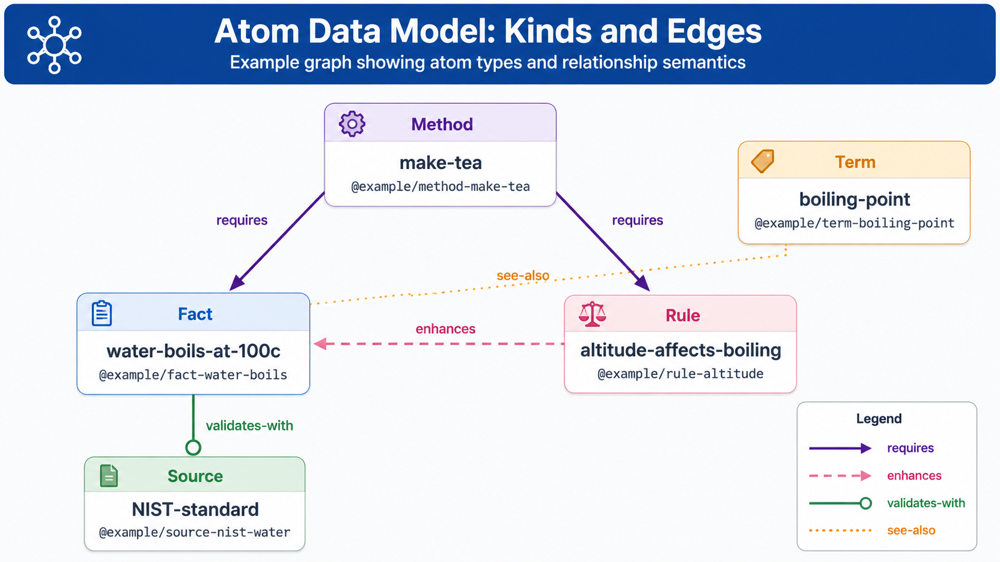

# DSL 速查

> `.prime` 源语言：词法结构、原子声明、28 种 kind、14 条边动词。
> 示例来自 `examples/recipes/`、`examples/coding-style/`、安全领域示例，
> 以及一个明确标注的前端设计领域示例。

[← 返回 README](../../../README.zh-CN.md) · [架构](../concept/architecture.md) · [设计哲学](../concept/philosophy.md) · [入门](../getting-started.md)

---

## 词法结构

`.prime` 源文件是 UTF-8 文本，**正好包含一个原子声明**。

| 词法元素 | 形式 | 例子 |
|---|---|---|
| 空白 | 空格、tab、换行 | 字段内不显著 |
| 行注释 | `// 到行尾` | `// 写于 2026-04-15` |
| 块注释 | `/* ... */` | 跨多行 |
| 标识符 | `[a-zA-Z_][a-zA-Z0-9_-]*` | `displayFont`、`must-include` |
| 连字字段名 | `kebab-name:` | `applies-to:`、`validates-with:` |
| 字符串 | `"..."` | `"纯水在 100°C 沸腾"` |
| 三引号块 | `"""..."""` | 保留换行和缩进 |
| Pipe 引用块 | 行首 `|` | 面向行的多行值 |
| 引用字面量 | `@scope/atom-id` | `@community/fact-spacing-token-progression` |
| 数字 | `123`、`0.99`、`1.5em`、`4 px` | 数值或带单位后缀 |
| 布尔 | `true`、`false` | |
| 范围 | `0.0-1.0`、`100–300ms` | 包头包尾 |
| 数组 | `[...]` 逗号或换行分隔 | `[a, b, c]` |
| 对象 | `{ key: value, ... }` | 嵌套任意层 |
| 联合类型 | `"low" \| "med" \| "high"` | |
| 枚举值 | `strong`、`medium`、`severe` | 值位上的裸标识符 |
| 函数签名 | `(input: Type) -> Output` | `method` body 用 |

Parser 实现了 **错误恢复**：一个字段语法错不会停止 parse。它跳到下一个
`key:` 继续，把全部错误一次性收集起来给诊断。

---

## 原子声明形式

每个原子文件**正好声明一个**原子。通用形式：

```
<kind> <PascalCaseName> {
  id:          "@<scope>/<kebab-name>"
  version:     "<semver>"
  description: "..."

  // kind 专属字段 ...

  related:     [@scope/atom, @scope/another, ...]

  // 仅对 persona / 高层 pattern：
  composition: { must-include: [...], must-avoid: [...], ... }
}
```

Parser 强制三条规则：

1. `kind` 关键字必须是 28 个之一。
2. `id:` 必须是 `@<scope>/<kebab-name>`，**全 corpus 唯一**。
3. 每种 kind 有自己的必填字段。少一个 parser 直接报错。

`<PascalCaseName>` 是给人看 / 编辑器查的。`id:` 是规范引用。

---

## 28 种 kind

每种 kind 属于五层之一。必填的 body 字段按 kind 区分。

### Data 层 —— 是什么 / 是真的

| Kind | 一句话用法 | 必填 body 字段 |
|---|---|---|
| `fact` | 经验性命题 + 置信度 + 来源 | `statement` |
| `term` | 概念定义 | `definition` |
| `value` | 命名 + 类型化的值（数值、颜色、尺寸） | `value` |
| `category` | 分类法的一类 | `members` 或 `criteria` |
| `example` | 正面范例 | `description` + 引用 / artifact |
| `counter-example` | 反面范例 | `description` + 它否定的对象 |
| `source` | 可引用的来源（论文、规范、指南） | `citation` |
| `metric` | 可测量的阈值或基准 | `threshold` 或 `range` |

### Behavior 层 —— 怎么做

| Kind | 一句话用法 | 必填 body 字段 |
|---|---|---|
| `step` | 序列里的一个离散动作 | `action` |
| `check` | 对 artifact 的通过/失败断言 | `assertion` |
| `transform` | 一种形式映射到另一种 | `from` + `to` |
| `tool` | 命名的软件工具或 API | `name` + `interface` |
| `method` | 多步过程，有 I/O | `body`（步骤） |

### Composition 层 —— 怎么组合

| Kind | 一句话用法 | 必填 body 字段 |
|---|---|---|
| `rule` | 规则约束（"总是 X" / "永不 Y"） | `claim` + `applies-to` |
| `taxonomy` | 分类层级 | `members` |
| `pattern` | 可复用的设计模式 + 变体 | `problem` + `solution` |
| `anti-pattern` | 主动避免的模式 | `problem` + `failure-mode` |
| `type` | 结构化类型定义 | `shape` |

### Style / Param 层 —— 风格 + 声音

| Kind | 一句话用法 | 必填 body 字段 |
|---|---|---|
| `persona` | 一个完整的立场 / 视角原子 —— 其他原子引用它来对齐风格或方法论。示例：设计 `persona`（"stripe-clean"）、安全 `persona`（"threat-modeller"）、烹饪 `persona`（"classical-french"）。 | `implies` + `composition` |
| `voice` | 写作语域 / 音调契约 | `register` + `prohibitions` |
| `constraint` | 不可覆盖的硬限制 | `target` + `severity` |
| `template` | 可复用的模板 —— 标记、文档结构、流程、配方，领域决定内容类型。 | `template`（body） |
| `provocation` | 对正统的有意冲击 | `claim` + `reasoning` |

### Meta 层 —— 知识组织

| Kind | 一句话用法 | 必填 body 字段 |
|---|---|---|
| `collection` | 可发布的原子打包（映射到一个 Prime） | `includes` |
| `scope` | 命名 namespace 边界 | `name` + `members` |
| `tradeoff` | 两个合理立场间的张力 | `position-a` + `position-b` |
| `principle` | 高层启发（不直接可执行） | `claim` |
| `feedback` | 回顾性观察 | `observation` |

---

## 14 条边动词



边声明类型化的原子间关系。Parser 知道每条 verb 的语义；L3 校验器按它
推理。

| 动词 | 语义 | 允许的源 kind | 允许的目标 kind | 例子 |
|---|---|---|---|---|
| `related` | 一般相关 —— 可发现 | 任意 | 任意 | `pattern → fact` |
| `requires` | 强依赖 —— A 加载 ⇒ B 必须加载 | `method`、`pattern`、`persona`、`rule` | 任意 | `method → step` |
| `enhances` | 软依赖 —— B 改善 A，但可选 | 任意 | 任意 | `persona → voice` |
| `validates-with` | A 的正确性由 B 验证 | `rule`、`fact`、`pattern` | `source`、`metric`、`check` | `rule → source` |
| `supplies-to` | A 提供 B 消费的值 | `template`、`value` | `persona`、`pattern` | `template → persona` |
| `specializes` | A 是 B 的子类型 | 任意 | 跟 A 同 kind | `persona → persona` |
| `extends` | A 继承 B 全部字段，覆盖指定项 | 任意 | 跟 A 同 kind | `persona → persona` |
| `derived-from` | 非继承的派生 | 任意 | 任意 | `rule → source` |
| `compatible` | 可同时组合，不冲突 | `persona`、`pattern` | `persona`、`pattern` | `persona → persona` |
| `conflicts` | 互斥 —— 不能同时加载 | `persona`、`pattern` | `persona`、`pattern` | `persona → persona` |
| `contradicts` | 命题对立（L3 标记） | `fact`、`rule` | `fact`、`rule` | `rule → fact` |
| `see-also` | 信息性交叉引用 | 任意 | 任意 | `fact → fact` |
| `includes` | Collection 列出成员 | `collection` | 任意 | `collection → method` |
| `relationships` | 通用 catch-all（遗留） | 任意 | 任意 | — |

"允许的源/目标"列只在合理时强制 —— 比如 `includes` 仅允许 `collection`
做源。其他 verb 任意 kind 对都允许。Plugin 启发式可以再加领域专属警告。

### 怎么挑动词

```
我加载 X 时 A 必须加载？           → requires
A 配 X 用更好但不必？               → enhances
A 和 X 永远不能同时加载？           → conflicts
A 和 X 命题对立？                   → contradicts
X 由 A 校验？                        → validates-with
A 是 X 的窄化形式？                 → specializes
A 继承 X 的字段？                   → extends
A 是 X 的非继承变体？               → derived-from
A 给 X 提供值？                      → supplies-to
A 和 X 显式可组合？                 → compatible
X 只是浏览时也看看 A？              → see-also
都不是，就是关联？                  → related
```

---

## 6 个例子

例 1–4 分别来自烹饪、团队编码规范和安全领域。例 5–6 来自前端设计领域
（有明确标注）。

### 例 1 —— `fact`

来自 `examples/recipes/`（随此 repo 附带）：

```prime
fact MeatRestingJuices {
  id: "@recipes/fact-meat-resting-juices"
  version: "1.0.0"

  description: "烹饪后静置肉类能让肌红蛋白中的汁液重新分布。"

  statement: "从火上取下后静置 5-10 分钟，能让肌肉纤维松弛，汁液重新分布，与立刻切相比含水量提升约 10%。"

  confidence: 0.92
  source: [
    "McGee, H. 'On Food and Cooking' (2004)，第 3 章。",
    "America's Test Kitchen 内部保水率测试。",
  ]

  applies-to: [
    "牛排和烤牛肉",
    "猪里脊和猪排",
    "禽类胸肉和大腿肉",
  ]

  quantitative: {
    rest-time-range: "5-10 min",
    moisture-gain: "与立刻切相比 ~10%",
  }

  related: [
    @recipes/term-myoglobin,
    @recipes/rule-carry-over-cooking,
  ]
}
```

各字段干什么：
- `statement` —— 中心命题，每层投影都出现
- `confidence` —— `strong` / `med` / `weak` 或数字 `0.0-1.0`
- `source` —— 来源；如果是原子用 `validates-with`
- `applies-to` —— 圈定 claim 的适用域
- `quantitative` —— 给下游 validator 用的结构化数值
- `related` —— 可发现的关联

### 例 2 —— `rule`

来自 `examples/coding-style/`（随此 repo 附带）：

```prime
rule NoImplicitAny {
  id: "@team/rule-no-implicit-any"
  version: "1.0.0"

  applies-to: ["本仓库 TypeScript 源文件"]

  description: "所有 TypeScript 声明必须有显式类型标注……"
  claim: "任何变量、参数、返回类型都不得依赖 TypeScript 的隐式 `any` 推断。所有公开 API 边界必须带显式类型。"
  severity: high

  validates-with: [@team/source-typescript-strict-mode-docs]
  checks: [@team/check-no-implicit-any-tsconfig]

  remediation: [
    "在 `tsconfig.json` 中开启 `noImplicitAny: true`。",
    "CI 跑 `tsc --noEmit`；错误数 > 0 则失败。",
  ]

  exceptions: [
    {
      case: "第三方类型存根",
      allowed-when: "外部包不带 `.d.ts`，且社区 `@types/` 包不存在。",
    }
  ]

  related: [@team/rule-strict-null-checks, @team/anti-pattern-type-assertion-abuse]
}
```

各字段干什么：
- `claim` —— 规则的处方语；精确、可被 grep
- `severity` —— `low` / `medium` / `high` / `critical`
- `applies-to` —— 圈定规则适用的 artifact 类
- `validates-with` —— 支撑 claim 的来源
- `checks` —— 链接到可执行 check 原子
- `remediation` / `exceptions` —— full 投影层的可执行细节

### 例 3 —— `pattern`

安全 corpus 示例，展示带类型化边的问题/解法对：

```prime
pattern ParameterisedQuery {
  id: "@security/pattern-parameterised-query"
  version: "1.0.0"

  domain: security

  problem: "直接将用户输入插入 SQL 字符串，使攻击者可以注入任意 SQL，绕过权限检查或窃取数据（OWASP A03：注入）。"
  solution: "始终用参数化语句将查询结构与数据分离。数据库驱动负责引用和转义；开发者代码不再用字符串拼接构建查询。"

  structure: """
    // 不安全：
    db.query(`SELECT * FROM users WHERE id = ${userId}`);

    // 安全（参数化）：
    db.query("SELECT * FROM users WHERE id = ?", [userId]);
  """

  behavior: [
    "所有用户提供的值都当参数，不当查询片段。",
    "默认强制参数化的 ORM 查询构建器。",
  ]

  compatible: [@security/pattern-input-validation]
  requires: [@security/check-no-string-concat-in-queries]
  validates-with: [@security/source-owasp-a03-injection]
  related: [@security/anti-pattern-dynamic-query-concat]
}
```

各字段干什么：
- `problem` / `solution` —— 经典 pattern 对
- `structure` —— 三引号原样保留代码
- `behavior` —— full 投影层的可执行清单
- `compatible` / `requires` / `validates-with` / `related` —— 类型化边

### 例 4 —— `persona`

安全 corpus 的 `persona`：

```prime
persona ThreatModeller {
  id: "@security/persona-threat-modeller"
  version: "1.0.0"

  description: "攻击者视角：假设已被突破，枚举攻击面，优先评估可利用性而非可能性。"

  implies: {
    stance: "对抗性 —— 先问'我怎么打穿这个'，再问'这有没有用'"
    scope: "网络边界、认证、数据流、外部依赖"
    output-format: "STRIDE 表格 + 风险等级清单"
  }

  compatible: ["red-team", "penetration-tester"]
  conflicts: ["optimist", "happy-path-tester"]

  composition: {
    must-include: [
      @security/taxonomy-stride,
      @security/check-attack-surface-enumerated,
      @security/principle-defence-in-depth,
    ]
    must-avoid: [
      @security/persona-optimist,
    ]
  }

  related: [@security/method-threat-model-review, @security/taxonomy-owasp-top10]
}
```

各字段干什么：
- `implies` —— 领域专属的结构化契约；内容由 corpus 自定义（协议不固定）
- `compatible` / `conflicts` —— 组合关系
- `composition.must-include` / `must-avoid` —— 协议级通用约束，L3 强制执行
- 前端 corpus 里的 `typography-required` / `color-required` / `motion-prescriptions`
  是**前端领域扩展字段**，不是协议的一部分 —— 参见
  [`spec/FRONTEND-DESIGN-DOMAIN-v1.md §3`](../../../spec/FRONTEND-DESIGN-DOMAIN-v1.md)

### 例 5 —— `method`

来自 `examples/recipes/`（随此 repo 附带）：

```prime
method MakePanSauce {
  id: "@recipes/method-make-pan-sauce"
  version: "1.0.0"

  input:  { pan: "带锅底精华的煎锅", liquid: "wine | stock | both", serving: number }
  output: { sauce: "去渣酱汁，~2 汤匙/份" }

  domain: cooking

  description: "经典锅底酱汁：刮起锅底精华后减少液体，得到光滑裹汁。"

  uses: [
    @recipes/step-deglaze-pan,
    @recipes/step-reduce-liquid,
    @recipes/step-mount-butter,
  ]

  body: [
    @recipes/step-deglaze-pan(pan, liquid) -> deglaised
    @recipes/step-reduce-liquid(deglaised, target: "50%") -> reduced
    if serving > 2:
      按比例增加液体
    @recipes/step-mount-butter(reduced) -> finished
  ]

  success-criteria: [@recipes/check-sauce-coats-spoon]

  related: [@recipes/fact-maillard-reaction, @recipes/term-fond, @recipes/method-make-stock]
}
```

各字段干什么：
- `input` / `output` —— 类型化 I/O 契约
- `uses` —— 引用 step 原子，类型化依赖
- `body` —— 把类型化 step 调用和控制流混在一起的伪代码
- `success-criteria` —— 校验 method 跑对了的 check 原子

### 例 6 —— `constraint`

*（此例来自前端设计 corpus —— `constraint` kind 在任何领域都一样用；
下方特定字段内容是前端专属的。）*

```prime
constraint OklchOnlyColor {
  id: "@community/constraint-oklch-only-color"
  version: "1.0.0"

  // 示例（前端领域）：'target' 和 'values' 字段通用；
  // 下方特定 CSS 语法是领域内容。
  target: ["author CSS 中的颜色值", "design token 原语"]
  severity: high
  domain: visual-design

  description: "所有新颜色声明必须用 oklch() 函数……"

  values: [
    {
      forbidden: "#rrggbb / #rgb hex 字面量",
      reason: "非感知均匀的 sRGB 编码",
    }
    {
      required: "oklch(L C H [/ A])",
    }
  ]

  rationale: "OKLCH 感知均匀：相同的 L 数值变化在所有色相上产生相同的感知亮度变化。"

  exceptions: [
    "外部库带来的第三方 CSS。",
  ]

  enforcement: "Stylelint 插件：`color-no-hex`、`color-named: never`。"

  related: [
    @community/check-color-oklch-required,
    @community/transform-rgb-to-oklch,
    @community/term-oklch,
  ]
}
```

各字段干什么：
- `target` —— constraint 适用的代码 / artifact / 系统
- `severity` —— `low` / `medium` / `high` / `critical`（constraint vs
  rule：constraint 不可覆盖；rule 可以有 exceptions）
- `values` —— 结构化 `forbidden` / `required` / `allowed` 列表
- `rationale` —— 解释；full 投影层出现
- `enforcement` —— 怎么机器检查

---

## 组合契约语法

任何原子都能声明 composition 契约。**协议定义两条通用字段** ——
`must-include` 和 `must-avoid`。领域 corpus 可通过 `domain.yaml` 的
`contract:` 块追加类型化子字段；这些子字段是领域专属的，不属于协议。

**协议级（任意领域）：**

```prime
composition: {
  must-include: [@scope/atom-id, ...]   // 本原子激活时必须载入
  must-avoid:   [@scope/atom-id, ...]   // 本原子激活时必须排除
}
```

**前端领域扩展**（在 `prime-corpus-frontend-design` 里；不是协议 ——
详见 [`spec/FRONTEND-DESIGN-DOMAIN-v1.md §3`](../../../spec/FRONTEND-DESIGN-DOMAIN-v1.md)）：

```prime
composition: {
  must-include: [...]
  must-avoid:   [...]

  // 前端领域子字段（corpus 专属，不是协议）：
  typography-required: { display: "字体名 | 备选", body: "字体名" }
  color-required: { background: "#f8f6f1", accent: "#a4451c" }
  motion-prescriptions: "克制、有目的；过渡 max 200ms"
}
```

**协议级契约执行：**

| 字段 | 强制时机 | 违反时怎么样 |
|---|---|---|
| `must-include` | L3（编译） + L5（输出校验） | 编译时目标缺则失败；输出未体现则失败 |
| `must-avoid` | L3（编译） + L5（输出校验） | 编译时同时选中则失败；输出出现则失败 |
| 领域专属子字段 | 仅 L5（领域 validator） | 领域 wrapper 按自身 schema 校验输出 |

---

## DSL 字段类型

| 类型 | 形式 | 备注 |
|---|---|---|
| 字符串 | `"..."` | Unicode；标准转义 |
| 三引号 | `"""..."""` | 保留换行 + 缩进 |
| Pipe | 行首 `|` | 面向行 |
| 数字 | `42`、`0.99`、`200ms`、`4px` | 单位后缀作为值的一部分 |
| 布尔 | `true`、`false` | |
| 范围 | `0-1`、`100–300ms` | 短破折号或连字符都行 |
| 数组 | `[a, b, c]` | 末尾逗号 OK |
| 对象 | `{ k: v, ... }` | 任意嵌套 |
| 引用 | `@scope/atom-id` | L1 校验 |
| 联合 | `"a" \| "b" \| "c"` | 字符串联合；当前对 parser 不透明 |
| 函数签名 | `(input: T) -> Output` | 仅 body 用 |
| 枚举值 | 裸 `strong`、`medium`、`high` | 值位上的标识符 |

---

## 拓展 {#extending}

28 种 kind + 14 种 verb 在 parser 里是固定的。要加新 kind 或 verb 需要
改 parser，并走 Tier-2 RFC 审。

### 加一种新 atom kind

代码路径：

1. **Type** —— 在 `packages/types/src/ast.ts` 给 `AtomKind` 加一行：
   ```ts
   export type AtomKind =
     | "fact" | "rule" | "method" | …
     | "your-new-kind";
   ```

2. **Lexer** —— 在 `packages/parser/src/lexer.ts` 注册关键字。

3. **Parser** —— 在 `packages/parser/src/parser.ts` 注册 schema。如果
   新 kind 和现有的（比如 `fact` 的 `statement` + tags）形状一样，复用
   handler；否则加分支声明必填字段。

4. **Chunker** —— 在 `packages/compiler/src/chunker.ts` 加 case，让
   `summary` / `core` / `full` 三层投影切得对。

5. **Fixture** —— 在 `examples/<corpus>/` 写一个用上新 kind 的样例
   原子，必须 parse + compile 通过。

6. **测试** —— 在 `packages/parser/test/` 加 parser 测试，在
   `packages/compiler/test/` 加 chunker 测试。

7. **Governance** —— 按 [community/governance](../community/governance.md)
   开 Tier-2 RFC issue，说明为什么需要这个 kind、和现有哪个最接近、
   你加了哪些测试。

总改动一般在 30–80 行 + 测试。Review 主要看新 kind 是不是真的新，
还是其实可以套现有 28 种里的某一个。

### 加一种新 edge verb

改动比 kind 小：

1. `packages/types/src/ast.ts` —— 加进 `EdgeVerb` union
2. `packages/parser/src/parser.ts` —— 在 relations parser 注册
3. `packages/compiler/src/edge-resolver.ts` —— 声明语义
   （正向 / 反向、必需 / 可选）
4. 测试 + RFC

### Roadmap：用 YAML 声明自定义 kind

`domain.yaml` 里的 `custom-kinds:` 块会让 corpus 不改 parser 就能声明
新 kind。计划在 [community/roadmap](../community/roadmap.md)。

---

## 接下去看

- [架构](../concept/architecture.md) —— 流水线怎么把这些原子变成 agent context
- [设计哲学](../concept/philosophy.md) —— 这个 DSL 为什么有这些原语
- [写 corpus](../guides/corpus-authoring.md) —— 端到端写一个自己的 corpus
- [协议规范 §1](../../../spec/PRIME-PROTOCOL-v1.md) —— 形式语法（仅英文）

---

*DSL 速查 v1.0 —— 覆盖 v1 冻结的语法。未来新增 verb / kind 是**补充**，
不是变更。*
