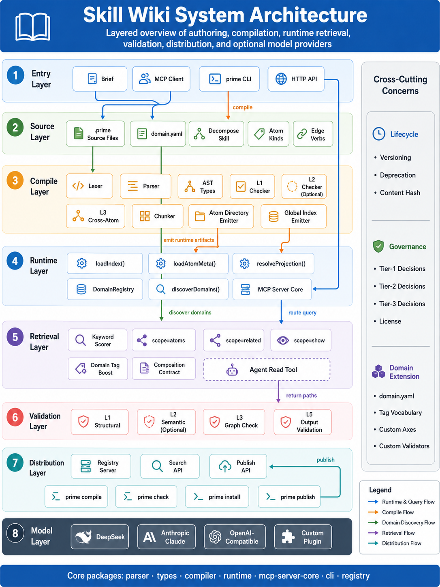
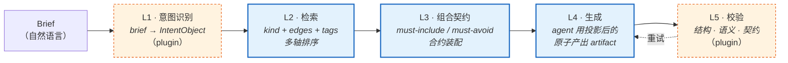
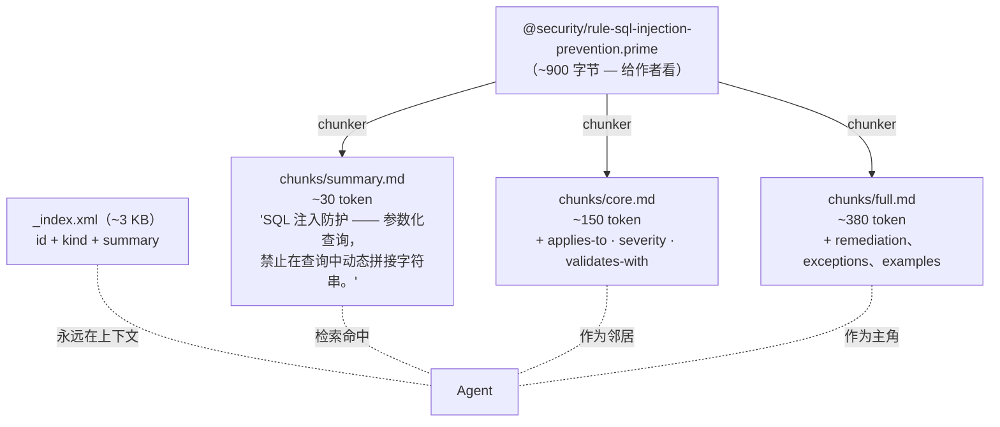
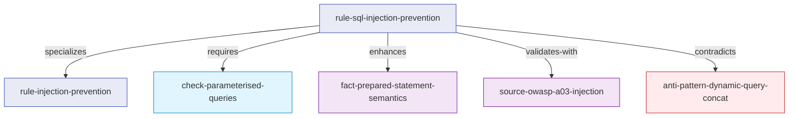
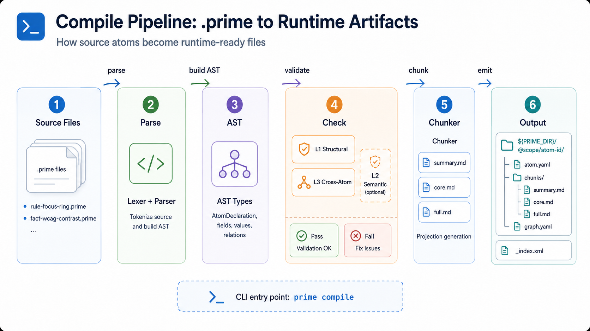
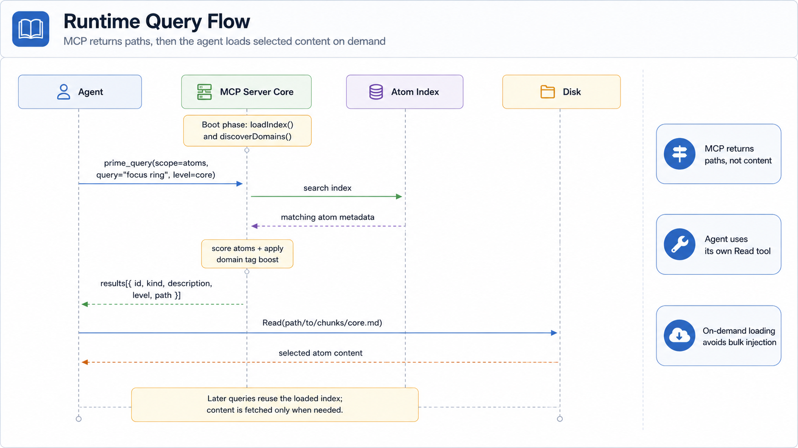
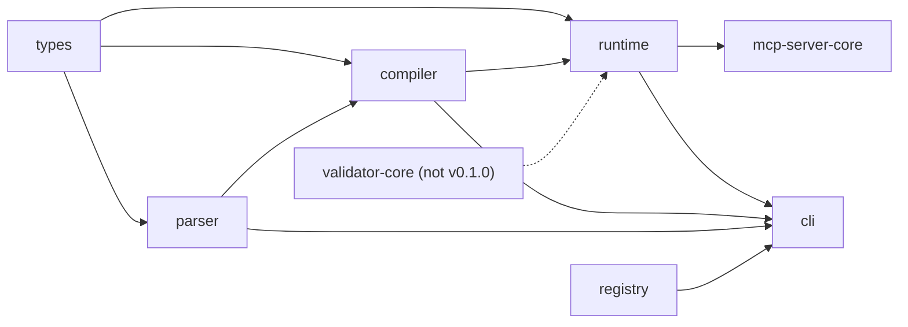

# 架构

> Skill Wiki / Prime 一层一层讲清楚。7 个 package，从 parser 到 MCP server。
> 这篇文档是核心导览：一个 brief 怎么变成最终输出，路上每个类型化原子待在哪儿。

[← 返回 README](../../../README.zh-CN.md) · [设计哲学](./philosophy.md) · [入门](../getting-started.md) · [DSL 速查](../reference/dsl-quickref.md)

---



整张图：从 agent brief 到 model providers 共 8 层，右侧带 lifecycle、governance、license、domain extension 四类横切关注点。

---

## 五层流水线

每一轮 Skill Wiki 调用都正好走五层。三层是 **协议** —— v1 已冻结的通用层。
两层是 **可插拔** —— 你的领域接进来。



### L1 — 意图识别（plugin 层）

Brief 是自由文本。L1 把它结构化成 `IntentObject`，其**形状由各领域自行
定义** —— 协议只规定 L1 必须产出一个可序列化对象，下游层可以读取。

例如，安全策略 corpus 的 IntentObject 可能是这样的：

```typescript
// 示例（安全领域）：由 corpus 自定义的 IntentObject 形状
interface SecurityIntentObject {
  task_type: string;            // "threat-model" | "compliance-check" | "code-review" | ...
  target_surface: string;       // "api-endpoint" | "auth-flow" | "data-pipeline" | ...
  severity_threshold: "low" | "medium" | "high" | "critical";
  required_frameworks: string[];  // ["owasp-top10", "nist-csf", ...]
  ambiguity_flags: string[];
}
```

前端设计 corpus 使用另一种形状（`task_type: "marketing-landing"`、
`motion_priority`、`density` 等），记录在
[`spec/FRONTEND-DESIGN-DOMAIN-v1.md §1`](../../../spec/FRONTEND-DESIGN-DOMAIN-v1.md)。
两者都是领域级决策，都不是协议本身。

整条流水线**只有这一层**接触自然语言。后面的全部代码都只看结构化对象。

通用的 `mcp-server-core` 不带任何 L1 实现 —— 它直接接受原始查询。
领域 wrapper（如前端 corpus 的 5-tool MCP）在上面加 L1。有
`DEEPSEEK_API_KEY` 时，用小 LLM 分类；否则退化为关键词启发式。

### L2 — 多轴检索（协议层）

检索是**结构化的**，不是 embedding 相似度。**轴由各领域定义** —— 协议提供
打分引擎，每个 corpus 在 `domain.yaml` 里声明自己的轴集合。

例如：前端设计 corpus 声明了 6 条轴（`register`、`pattern`、`motion`、
`typography`、`color`、`rules`）；安全 corpus 可能声明 4 条（`auth`、
`inputs`、`secrets`、`audit`）；菜谱 corpus 可能声明 4 条（`technique`、
`cuisine`、`equipment`、`time`）。协议不知道任何轴名的含义。

*（前端设计 6 条轴的详细说明见
[`spec/FRONTEND-DESIGN-DOMAIN-v1.md §2`](../../../spec/FRONTEND-DESIGN-DOMAIN-v1.md)。）*

每条轴里的排序是 5 层级联，专门为了在 brief 噪声大的情况下让类型化知识
仍然稳：

| 层 | 信号 |
|---|---|
| 1 | `id` + `description` 上的 token overlap |
| 2 | Topic synonym（跨语言："排版" / "typography" / "字体" 同归同一主题） |
| 3 | Kind boost —— 每个 corpus 通过 `PRIME_KIND_BOOSTS` 或 `domain.yaml` 配置 |
| 4 | Topic-kind affinity —— domain plugin 把主题映射到偏好的 kind |
| 5 | Intent 直接命中 —— L1 IntentObject 字段 boost 命中的原子 |

光跑 cosine similarity 的 ranker 只能返回"prose 里巧好有词命中 brief 的"
原子。Skill Wiki 的 ranker **每一个排序都能解释** —— 多少分来自 kind
boost，多少来自 topic 映射，多少来自直接命中。可解释性是**类型化知识的
副产品**，不是事后补的。

### L3 — 组合契约（协议层）

检索选完 ~10–20 个候选之后，L3 把带 `composition:` 块的原子里声明的契约
执行掉。**协议定义两条通用字段**：`must-include` 和 `must-avoid`；领域 corpus
可通过 `domain.yaml` 的 `contract:` 块追加类型化的子字段（参见
[`spec/FRONTEND-DESIGN-DOMAIN-v1.md §3`](../../../spec/FRONTEND-DESIGN-DOMAIN-v1.md)
中前端领域对 `typography-required`、`motion-prescriptions` 等字段的扩展）。

来自 `examples/recipes/` 的通用示例：

```prime
persona MichelinFineDining {
  id: "@recipes/persona-michelin-fine-dining"
  version: "1.0.0"

  composition: {
    must-include: [
      @recipes/rule-mise-en-place,
      @recipes/rule-acid-balance,
      @recipes/check-plating-discipline,
    ]
    must-avoid: [
      @recipes/persona-comfort-food,
      @recipes/anti-pattern-overgarnishing,
    ]
  }
}
```

合成器走 must-include / must-avoid 集合，重写候选列表。如果 brief 同时
选中了 `persona-michelin-fine-dining` 和 `persona-comfort-food` —— 两者
冲突 —— L3 直接把契约判失败，把冲突暴露出来。

**这是知识组合的类型系统**。自由文本能容纳任何内部矛盾；契约校验过的
组合不能。

### L4 — 生成（plugin 层）

生成阶段就是 agent 干自己的活。Skill Wiki 给 agent 一个 *atom plan* ——
"按这些投影层级载入这些原子 ID，必须包含这些，必须避开这些" —— 然后
把计划交给 agent。Agent 用 `Read` 工具按需拉 chunk 路径，然后写 artifact。

L4 是 Skill Wiki **最不控制**的一层。我们提供输入（类型化原子 + 契约 +
投影层级）；写文是 agent 的事。

### L5 — 输出校验（plugin 层）

Artifact 出来之后，由领域的 L5 plugin 执行校验。协议定义三个子层槽位；
校验逻辑由各领域实现：

| 子层 | 协议槽位 | 前端领域示例 | 安全领域示例 |
|---|---|---|---|
| `l1-structure` | 解析输出，检查结构完整性 | ARIA label；标题层级 | 策略字段齐全；severity 已声明 |
| `l2-semantic` | 小 LLM 语义 / 美学符合度 | "是否符合所选 register？" | "是否覆盖了声明的威胁面？" |
| `l3-composition` | must-include 是否体现？must-avoid 是否渗入？ | persona 契约核查 | 框架约束核查 |

校验失败时，validator 出一份结构化的 retry prompt，点名违规的原子和契约。
Agent 把 prompt 加到上下文重新生成。最多两轮重试，失败上交人类。

> **为什么是 "L5" 不是 "L4"？** L1/L2/L3 是 **编译期** 三层校验（parser、
> 语义、跨原子图）。L4 = agent 生成。L5 是 **运行时**的输出校验。命名一致：
> L 前缀 = 校验层 N。生成阶段没有 L 编号。

---

## 投影模型

每个原子编译出三层投影。Agent 永远不会一次看到完整源；它看的是 *存在感*
索引，要详细内容时按 ID 拉投影。



Chunker（`packages/compiler/src/chunker.ts`）走一遍 AST，每个原子产出
3 份 Markdown：

```typescript
// packages/compiler/src/chunker.ts（签名）
export interface ChunkLevels {
  /** ~30 token：description + tags + 一句话 claim */
  summary: string;
  /** ~150 token：+ 主体字段 */
  core: string;
  /** ~380 token：+ sources + examples + relations + notes */
  full: string;
}
```

每层放什么，**按 kind 区分**：

| Kind | summary 层 | core 层 | full 层 |
|---|---|---|---|
| `rule` | 规则 claim | + applies-when、severity | + remediation、exceptions |
| `pattern` | 问题陈述 | + 解法 + structure | + examples、behaviors |
| `fact` | 命题 | + 置信度 + applies-to | + sources、counter-conditions |
| `persona` | 一句话立场描述 | + `composition.{must-include, must-avoid}` + 领域专属 implies 字段 | + 例子、笔记 |

Agent 自己决定要哪一层；runtime 解析路径。Token 预算从"全装上"变成
"这一轮真用得到的那一层"。

这是整个系统**最关键**的设计决策。详见
[philosophy.md](./philosophy.md#为什么是投影不是注入)。

---

## 边图

边是有类型的。它**不是魔法字符串** —— parser 知道每条 verb 的语义，L3
跨原子校验器按语义推理。



14 条边动词分三个语义家族：

**加载纪律**——控制什么进入 agent 上下文：
- `requires` —— A 加载 ⇒ B 必须加载
- `enhances` —— A 加载 ⇒ B 改善输出，但非必需
- `conflicts` —— 不能同时加载
- `compatible` —— 显式声明可同时加载
- `includes` —— Collection 列出成员

**类型系统**——描述原子作为类型怎么相互联系：
- `specializes` —— 更窄的子类型
- `extends` —— 继承全部字段，覆盖指定项
- `derived-from` —— 非继承的派生

**语义关系**——描述真值层面的关系：
- `contradicts` —— 命题对立（L3 标记）
- `validates-with` —— A 的正确性由 B 验证
- `supplies-to` —— A 提供 B 消费的值
- `related` / `see-also` —— 可发现的关联
- `relationships` —— 遗留 catch-all

类型化让检索器变聪明，让 validator 变严格。普通"related" 超链接什么都
能装；`validates-with` 是有约束力的：原子声明 `validates-with
@w3c/wcag-2.2-1.4.3`，L3 校验器**会确认目标存在并自身有效**。

前端设计 corpus（在 `prime-corpus-frontend` 里，899 原子）编译出
~3,096 条边，平均 ~4.2 边/原子。最高频是 `related`（~88%），然后
`compatible`、`conflicts`、`validates-with`、`includes`。这些数字是该
corpus 自身的特性；安全或菜谱 corpus 会因各自偏重 `validates-with`（来源
密集型领域）还是 `requires`（步骤密集型领域）而呈现不同的比例。

每条 verb 的来源 / 目标 kind 配对见
[DSL 速查](../reference/dsl-quickref.md#14-种边动词)。

---

## 编译期 vs 运行时分离

Skill Wiki 有两个截然分开的阶段。它们共享 types，但从不直接对话。

### 编译期（`packages/compiler/`）

输入：`.prime` 源文件（给作者看）。



流水线：

```
sources/*.prime
    ↓ packages/parser/  （lex + parse）
    ↓ checker-l1.ts     （schema + 必填字段 + 引用解析）
    ↓ checker-l3.ts     （循环检测 · 跨原子矛盾）
    ↓ checker-l2.ts     （可选 — 小 LLM 语义校验，$0.0001/原子）
    ↓ chunker.ts        （每个原子拆 summary/core/full 三层）
    ↓ atom-dir-emitter  （每个原子一个目录 — chunks/ + atom.yaml + graph.yaml）
    ↓ global-index-emitter  （_index.xml — 永远在上下文的索引）
compiled/
```

L1 必跑。L3 必跑。L2 可选，没设 API key 就**优雅跳过** —— 此时假定作者
负责语义自洽。L2 抓的是这种东西：原子 description 说 "low contrast"，
severity 标 `low`，但 remediation 描述的是关键 a11y blocker。便宜跑，
偶尔决定性。

### 运行时（`packages/runtime/`）

输入：`compiled/` 目录。



Runtime 有一条铁律：**永远不读 chunk 内容**。它读 `_index.xml` 和每个
原子的 `atom.yaml`（仅元数据）来构建内存图。Chunk markdown 留在磁盘上；
检索命中后由 agent 用自己的 `Read` 工具去取。

```typescript
// packages/runtime/src/atom-loader.ts
//
// IMPORTANT: This module NEVER reads chunks/*.md content.
// It only reads _index.xml and atom.yaml (metadata).
// Chunk content is exclusively for the agent to pull via the Read tool.
```

这种分离是系统**便宜**的根源：runtime 占 agent context ~3 KB，跟 corpus
大小无关；chunk 留在磁盘上，按需进入上下文。

---

## Domain plugin 架构

Skill Wiki 本身只发 **协议** —— 28 种 kind、14 条 verb、5 层流水线。
**领域**（前端设计、安全、菜谱……）通过 DomainRegistry 模式接入。

```typescript
// packages/runtime/src/domain-plugin.ts
export interface DomainPlugin {
  /** 稳定的领域 ID，kebab-case（比如 "frontend-design"）。 */
  readonly name: string;
  /** 标准 tag 词表 — 用于排序和 scope 检查。 */
  readonly tags: ReadonlyArray<string>;
  /** 这个 prime 属于本领域吗？ */
  scopeCheck(ast: PrimeAST): boolean;
  /** 可选的领域专属 L2 启发式。 */
  extraHeuristics?(ast: PrimeAST): DomainDiagnostic[];
}
```

一个 domain plugin 提供：

1. **Tag 词表**。前端：`warm`、`literary`、`fintech`；安全：`auth`、
   `secrets`、`audit`。Retriever 把同领域 tag 加权。
2. **Scope check**。给一个 parse 好的原子，它属于本领域吗？通常是 tag
   或 namespace 检查。
3. **额外启发式**。领域专属的 L2 检查。frontend-design plugin 加这种规则：
   "persona 声明了 `font.display` 但没声明 `font.body`，warn"。安全可能
   加 "rule 标了 `severity: high` 但没 `validates-with`，warn"。

多个 domain 可以同时注册。不属于任何领域的原子保持可查询，但不加权。

我们打包随发的 frontend-design corpus（在 `prime-corpus-frontend`）本身
就是一个 domain plugin。**换 corpus 就是换 plugin** —— 这是扩展单元。
[corpus-authoring.md](../guides/corpus-authoring.md) 有写 corpus 的
完整指南。

---

## 各 package 装了什么

```
packages/
├── parser/           .prime DSL 词法 + 递归下降 parser
├── types/            共享 TS 类型（AtomKind、EdgeVerb、ProjectionLevel、AST 节点）
├── compiler/         L1/L2/L3 校验、edge resolver、chunker、atom-dir emitter
├── runtime/          原子 loader、投影解析、domain plugin host
├── validator-core/   通用 L1/L2/L3 输出校验框架（v0.1.0 未发布）
├── registry/         HTTP 包注册表 — publish / install
├── cli/              `prime` 命令
└── mcp-server-core/  通用 MCP server：prime_query 跑在任何编译好的 corpus
```

依赖图：



`types` 是**协议契约**，所有 package 依赖它。其他 package **互不依赖** ——
依赖图是树，不是网。下一代的 parser v2、compiler v2 可以单独发，不动其他
package。

---

## MCP server-core

`packages/mcp-server-core/` 是一个 ~200 行的 MCP server。它对任何编译好的
corpus 暴露**正好一个**工具：

```typescript
prime_query({
  scope: "atoms" | "related" | "graph" | "search",
  id?: string,
  query?: string,
  level?: "summary" | "core" | "full",
  depth?: number,
}) → AtomList | AtomDetail | AdjacencyList
```

它读 `compiled/_index.xml`，在内存里走图，按你给的层级返回原子。**没有
任何领域知识** —— 每个 query 都是结构化的。

领域 corpus 通常在这个核心之上再包一层领域感知工具。例如，前端 corpus
暴露 5 个工具（`prime_compile`、`prime_intent`、`prime_query`、
`prime_resolve`、`prime_validate`），加意图分类和 6 轴检索；安全 corpus
可能暴露一个 `policy_check` 工具，对文本输入跑合规校验。这些领域 wrapper
**不在 system 仓库里**，跟着各自的 corpus 一起发。

详见 [docs/zh-CN/mcp.md](../guides/mcp.md)。

---

## 性能数据

三个值得记的数：

| 性能项 | 值 | 为什么 |
|---|---|---|
| 构建时间 | 5 原子 hello-world ~80ms；899 原子前端 corpus ~10s | Node 22+ 原生 TS strip；不转译；chunker O(原子 × 字段) |
| 索引大小 | 5 原子 ~800 字节；1000 原子 ~3 KB | 索引只有 `id + kind + summary` —— 字节随原子数线性 |
| 单 query 工作量 | ID 查找 O(log n)；图遍历 O(邻居)；最坏检索 O(原子 × 轴) | `loadIndex` 之后全在内存 |

Agent 的上下文从来**不持有所有原子**。它持有索引 + 检索选中的投影 ——
通常每轮 5–8 个原子，每个一层投影。1000 原子的 corpus 上，每轮加载的
原子内容 < 10 KB，对比"全装"模式的 ~400 KB。

---

## 接下去看

- [设计哲学](./philosophy.md) —— 架构**为什么**长这样
- [入门](../getting-started.md) —— 端到端启动一遍系统
- [DSL 速查](../reference/dsl-quickref.md) —— 28 种 kind、14 条 verb 的细节
- [协议规范](../../../spec/PRIME-PROTOCOL-v1.md) —— v1 协议正式语法（仅英文）

---

*架构文档 v1.0 —— 文档和代码不一致就是 bug，直接报。*
