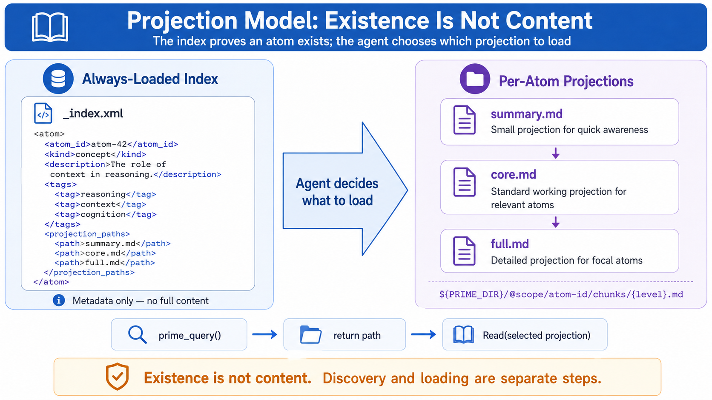

# 设计哲学

> Skill Wiki 为什么长这样。五条扛事的决策，每一条都有它在抵抗的具体
> failure mode。

[← 返回 README](../../../README.zh-CN.md) · [架构](./architecture.md) · [入门](../getting-started.md) · [DSL 速查](../reference/dsl-quickref.md)

---

## 一句话立场

> **存在 ≠ 内容。**

知道"OWASP 输入校验规则"这种东西**有定义** —— 跟把它那 1841 字节的
prose 全部塞进 working memory 是两件事。Wikipedia 把这两件事分开了 ——
每个读者都知道百科有"质数"词条，但读者不会**先把所有词条都加载到脑子
里**再去查。Skill Wiki 之前的 agent 栈基本都把这两件事混了：每个**可能**
相关的 Skill，每轮都把全文塞进 prompt。

整个设计就是从这条线开始翻转的。这篇文档剩下的内容，都是**认真对待
这一句**的副产品。

---

## 决策一 —— 类型化原子，不是 blob skill

教 LLM agent 一件事，主流模式是：写一份 ~200 行 markdown，加个 YAML
frontmatter，分几个 section，给点 example。当相关时 load 进 system prompt。

这套在小规模 work，规模一上就崩。崩**不是因为字多**。崩是**信息论**：

- prose 块的**熵**高 —— 同一个想法 50 种写法。两个 blob 在讲同一条
  规则，但措辞不一样，retriever 没法对齐。
- prose 块的**类型度**低 —— 系统没法说"只给我 persona 类的原子"，因为
  里面没有 persona，只有段落。
- prose 块**没有边界** —— 想用其中三条规则，得在脑子里把它们抽出来，
  模型还得忽略其他的。

原子设计就是直接回应。每个知识单元声明：

1. **kind**。28 选 1 —— `fact`、`rule`、`pattern`、`persona`、`term`、
   `method`、`constraint`……
2. **必填字段（按 kind）**。`rule` 必须有 `claim` + `applies-when`。
   `persona` 必须有 `composition.{must-include, must-avoid}`。
   `pattern` 必须有 `problem` + `solution`。Parser 编译时强制。
3. **类型化引用**。不是"see also: X"，而是 `requires: X`、`enhances: X`、
   `validates-with: X`。

知识有了 kind，retriever 就能按 kind 查询，validator 就能按 schema
检查，chunker 就能产出按 kind 分层的投影，conflict-finder 就能抓到两个
`fact` 在同一个 `applies-to` 上互相矛盾。

跟 TypeScript 之于 JavaScript 是同一份收益。**类型不会替你写代码；
它抓的是那种随代码量线性增长、随团队规模超线性增长的错误**。

200 行 markdown skill 是 JavaScript。原子 corpus 是它的类型化版本。

---

## 决策二 —— 投影懒加载，不是上下文注入



Skill Wiki 中心的架构反转：

| 主动注入 | 投影懒加载 |
|---|---|
| 所有可能相关的 Skill 都装进 system prompt | 只有"什么存在"的索引永远在上下文 |
| 按 tag / trigger 加载 Skill | 按检索排序 + agent 自决加载原子 |
| Token 成本随 Skill 数增长 | Token 成本随任务复杂度增长 |
| 一个坏 Skill 污染每一轮 | 坏原子被每轮的相关性过滤掉 |

之前的模式是 **push** —— 系统把 brief 可能用到的全推进上下文，赌模型
能挑对。这就是我们测出来的**上下文污染** —— 不是 token 太多，是**错的
token 主动误导模型**。

Skill Wiki 是 **pull** —— 索引说"GDPR 数据删除权规则的原子存在"，agent
自己决定要不要拉它的 summary / core / full。Token 成本被 agent 真用到的
那部分裁住，跟 corpus 大小**解耦**。

Wikipedia 的类比是精确的：每个读者都知道百科**有**质数那一篇，并不需要
先 load 那一篇；读者点过去再 load。这种解耦是整个设计。

> **Agent 按 ID 拉。系统永远不按"猜一下相关性"主动注入。**

听上去像实现细节。它是让 1000 原子的 corpus 跑得比 50 个 blob skill
还便宜的那条线，是让 corpus 在长大到任何人脑子都装不下的时候**还能保持
一致**的那条线。

### <a id="为什么是投影不是注入"></a>为什么是投影，不是注入

更具体地：注入式系统里，prompt 的成本由"corpus 多大"决定。投影式系统
里，成本由"这一轮真的用了多少"决定。两者随着规模拉开的差距是**几何级**
的，不是常数。

50 atoms 时差不多。500 atoms 时注入式开始崩。5000 atoms 时投影是**唯一
能跑**的设计。

---

## 决策三 —— 边动词，不是平表 related

普通 "related" 链接是超链接。它说：有某种联系。点进去就知道了。

类型化的边说："A *requires* B" —— A 加载则 B 必须加载。"A *conflicts* B"
—— 不能同时加载。"A *contradicts* B" —— 它们语义对立。

动词**扛事**。Retriever、validator、compositor 三方都按动词的**不同**
行为变化：

- **Retriever**：brief 选中原子 A 之后，沿 `requires` 边外扩，把目标
  当主角加进来；沿 `enhances` 加进来当软附属；沿 `conflicts` 把目标
  **排除**。三种图遍历，三种结果，全靠边类型。
- **Validator**：A 和 B 之间有 `contradicts` 是 L3 标记 —— 同时加载
  会被 validator 上报给用户。`validates-with` 校验目标本身存在并合法。
- **Compositor**：persona 的 `composition.must-include` 变成候选集的
  **约束**。Compositor 每轮在解一个小约束问题。

平表 "related" **驱动不了**这里任何一个。三个操作里有三个都需要知道
**关系是什么**。

14 条动词不是拍脑袋。每条都对应一个系统真实需要的行为：

- 加载纪律：`requires`、`enhances`、`conflicts`、`compatible`、`includes`（5）
- 类型系统：`specializes`、`extends`、`derived-from`（3）
- 真值关系：`contradicts`、`validates-with`、`supplies-to`（3）
- 仅可发现：`related`、`see-also`、`relationships`（3）

可不可以更多？可以。我们故意停在 14。**过了某个数，边动词就和无类型
字符串一样不透明**了 —— 作者乱猜用哪个，corpus 变得不一致。14 是每条
都有清晰契约、且作者**能全部装进脑子**的临界点。

---

## 决策四 —— 组合契约，不是自由组合

大部分知识系统把组合丢给 agent："这是 50 条规则，这是你的任务，自己
判断哪些适用"。模型猜；偶尔猜错；你看不出哪一次猜错了。

组合契约把约束**显式**写出来。来自安全审计 corpus 的 `persona` 原子示例：

```prime
persona ThreatModeller {
  id: "@security/persona-threat-modeller"
  version: "1.0.0"

  description: "攻击者视角：假设已被突破，枚举攻击面，优先评估可利用性。"

  composition: {
    must-include: [
      @security/principle-defence-in-depth,
      @security/check-input-validation-coverage,
      @security/taxonomy-owasp-top10,
    ]
    must-avoid: [
      @security/persona-optimist,
    ]
  }
}
```

*（前端 corpus 里 `composition` 下的 `typography-required` /
`color-required` / `motion-prescriptions` 等字段是领域专属扩展，
不是协议本身。参见
[`spec/FRONTEND-DESIGN-DOMAIN-v1.md §3`](../../../spec/FRONTEND-DESIGN-DOMAIN-v1.md)。）*

三件事现在**机器可校验**：

1. 如果 brief 选中 `persona-threat-modeller`，compositor **必须**载入那三个
   principle/check/taxonomy 原子。它们不是建议，是契约条款。
2. 如果 `persona-optimist` 也被选了，L3 校验器**会**判 composition 无效。
3. 如果 agent 输出遗漏了输入校验覆盖，L5 契约 validator 抓出 must-include 的违例。

这是**领域知识组合**的类型系统。两条通用字段 —— must-include、must-avoid ——
在两个不同阶段强制执行；领域通过 `domain.yaml` 的 `contract:` 追加类型化子字段。

自由组合是没类型的 JavaScript。契约组合是 TypeScript：大多数时候
约束没触发；触发的时候，bug 在到达用户**之前**就被抓住。

---

## 决策五 —— 用小 LLM 编译知识

2024 之前，"自然语言主张的语义校验"是研究级问题。你能写一个 `fact` 说
"蓝光抑制褪黑素"，再写一个 `fact` 说"屏幕色温不影响睡眠"，系统**完全
没办法**知道它们矛盾。

两件事同时变了：

1. **小模型变便宜**。一对原子做语义等价判断现在大约 $0.0001。1000 个
   原子全量校验 $0.10。
2. **小模型变得够稳**。不是说自由生成够稳 —— 是说**约束的是非判断**
   够稳。"这两条 claim 的 applies-to 集合一样吗？它们一致吗？" Haiku
   级别的模型答得对的概率高到能用，错的频率低到值得人工复核。

这就是 compiler 的 **L2** 层。每个原子跑一次（每对 `contradicts` 边
跑一次），编译时执行。它抓的是 schema 静态校验**抓不到**的一类 bug：

- 两个 `fact` 在同一个 `applies-to` 上互相矛盾
- 一个 `rule` 的 `severity` 是 `low`，但 `description` 写的是关键
  blocker
- 一个 `persona` 的 `implies.color` 包含了它 `prohibitions` 禁掉的
  颜色

这些**不是语法错误**，是**内部矛盾** —— 12 个月以上的 corpus 因为不同作者
不同时间贡献，慢慢漂移过去的那种 bug。同样的模式出现在法律 corpus（"GDPR
Art.17 要求删除"vs 某条断言"留存永远被允许"）、安全 corpus（"强制 TLS 1.3"
vs 遗留规则允许 TLS 1.1）、菜谱 corpus（"意面水必须加盐"vs 某条旧原子
说盐不影响口感）。

L2 是可选的。设了 `DEEPSEEK_API_KEY` 就跑；没设就**优雅跳过**。把它
列成决策五，不是因为每个 corpus 都需要，而是因为它代表了一类**之前
不存在**的事：**编译时读自然语言并对它做推理**。

传统 compiler 不读 prose。Skill Wiki 的读。这是**新地基**。

---

## 它**不是**什么

我们想过、又主动放弃的几种模式：

### 不是向量数据库

embedding 相似度检索快、不透明、不可推理。Cosine 相似度对 kind / 边 /
契约**没有意见**。它返回的是 "prose 跟 brief 字面像" 的东西。当 prose
里有推理陷阱（L2 那一层抓的那种），embedding 检索**完全没有防御**。

这不是黑向量检索 —— 它是"在百万级文档里找相关文档"的对工具。Skill
Wiki 的工作不一样：几千个**有语义结构**的原子，检索要**可解释**。
不同问题，不同形状。

你可以在 Skill Wiki **上面再叠** embedding。协议不要求，也不禁止。

### 不是模型

Skill Wiki 对你用哪个 LLM 没有意见。协议层只跑在 Node 22+ 上，没有任何
模型依赖。Plugin（意图识别、语义校验）跟 LLM 对话，但**协议**不绑定
任何模型。

这种解耦是有意的。**知识库应该比任何特定模型的发布周期活得长**。今天
为某代模型写的 corpus，明天的下一代上还能 type-check 通过。

### 不是 Skill 的替代

Skill 是工作流配方 —— "用户说 X 时，做 Y，再做 Z"。Skill 在编排，决定
什么时候做什么。Skill Wiki 提供工作流**消费**的原子。

两者**互补**。未来一个 Skill 也许是 30 行编排 + 引用一堆原子 ID：

```yaml
imports:
  - @nielsen/taxonomy-10-heuristics: full
  - @impeccable/persona-editorial: core
  - @w3c/wcag-2.2-rules: summary
sequence:
  - apply @nielsen/heuristic-1
  - check @w3c/contrast-aa
  - report
```

工作流是编排层。Skill Wiki 是知识层。**不同关注点，都必要**。

### 不绑定任何题材

28 种 kind + 14 条 verb 是关于**知识本身结构**的抽象，不约束任何具体题材。
前端设计 corpus、安全策略 corpus、烹饪 corpus、法律条款 corpus 各自用相同的
28 种 kind 表达知识，走相同的 14 条 verb 连接原子。协议在跨题材时一字不变。

新领域通过注册一个 `DomainPlugin` 接入。看
[architecture.md#domain-plugin-架构](./architecture.md#domain-plugin-架构)。


## 接下来要长成什么

这篇是 v1。协议在 1.0 冻结两年。再往后：

- **原子生命周期**。今天 `deprecated` 是个标志位。明天 compiler 在
  `deprecated` 原子出现在检索结果时**发警告**，并拒绝发布一个依赖
  其他 corpus 已弃用原子的新 corpus。**原子要会缩，不只会长**。
- **Domain plugin 形式化**。DomainRegistry 模式在代码里；**正式**
  domain-plugin spec 在 roadmap 里。v1.1 会写清楚一个 plugin 必须实现
  什么。
- **来源和可信度**。`source` 原子可以引文。未来版本里，引用是**可
  验证**的 —— compiler 能确认引用的论文存在并支撑那条 claim。

这些都是**同一条轴**的延伸。知识被类型化；类型被强制；强制随时间
扩展到更多维度。

---

## 一句话收尾

> **知识有结构。尊重结构，成本下来，质量上去，系统在变聪明的同时变小。**

或者，落到代码上的那一句：

> 存在 ≠ 内容。

[读架构。](./architecture.md)
