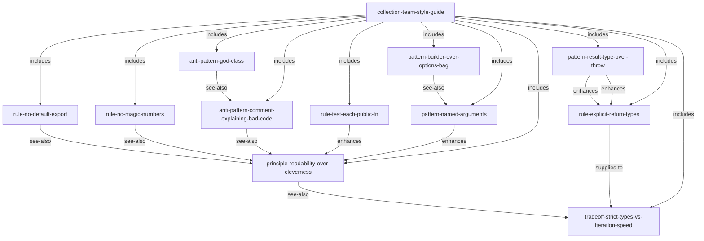

# Coding Style — Team Lint Rules Corpus

> Twelve atoms encoding a TypeScript team's code-style policy as a AOE corpus.

This corpus answers a common question: *can I encode my team's engineering standards as
AOE atoms and serve them to an AI coding agent?*

The answer is yes. This corpus models a hypothetical TypeScript team's style guide —
4 enforced rules, 3 preferred patterns, 2 active anti-patterns, 1 principle, 1 collection,
and 1 explicit trade-off.

---

## Why this corpus exists

It demonstrates two things:

1. **Institutional knowledge as atoms.** A `.eslintrc` enforces rules but doesn't explain
   *why* they exist. A AOE corpus gives every rule a `description`, `notes`, and
   edges to the other rules it relates to. An AI coding agent can load the relevant subset
   when it's actually needed — not the entire style guide on every turn.

2. **The `tradeoff` kind.** Real engineering decisions involve genuine tensions, not just
   right-answers. This corpus has one `tradeoff` atom (`strict-types-vs-iteration-speed`)
   that names both sides honestly, because an agent that doesn't know about the trade-off
   will keep resolving it the same way regardless of context.

---

## Atom catalog

### Rules — enforced by ESLint / CI

| Atom ID | Summary |
|---|---|
| `@team/rule-no-default-export` | All exports must be named; no `export default`. |
| `@team/rule-explicit-return-types` | Exported functions must have explicit return type annotations. |
| `@team/rule-no-magic-numbers` | Numeric literals beyond 0 and 1 must be named constants. |
| `@team/rule-test-each-public-fn` | Every exported function must have at least one test. |

### Patterns — preferred solutions

| Atom ID | Summary |
|---|---|
| `@team/pattern-result-type-over-throw` | Return `Result<T, E>` for expected failures; don't throw. |
| `@team/pattern-builder-over-options-bag` | Use a fluent builder when a constructor takes 4+ parameters. |
| `@team/pattern-named-arguments` | Use a named-argument object over positional parameters. |

### Anti-patterns — actively flagged in review

| Atom ID | Summary |
|---|---|
| `@team/anti-pattern-god-class` | A class with too many responsibilities; violates SRP. |
| `@team/anti-pattern-comment-explaining-bad-code` | Comments that explain what bad code does instead of rewriting it. |

### Principle — the root heuristic

| Atom ID | Summary |
|---|---|
| `@team/principle-readability-over-cleverness` | Optimize for the reader in 6 months, not the author today. |

### Trade-off — an explicit tension

| Atom ID | Summary |
|---|---|
| `@team/tradeoff-strict-types-vs-iteration-speed` | Strict TypeScript vs. velocity; when to enforce vs. defer. |

### Collection — the bundle

| Atom ID | Summary |
|---|---|
| `@team/collection-team-style-guide` | Bundles all 11 atoms above into one installable style guide. |

---

## Atom graph



The principle is the root; the trade-off is the honest acknowledgment that the principle has limits.
Every rule and pattern points back to the principle as its justification.

---

## How to compile

```bash
cd examples/coding-style
aoe compile primes/sources --out primes/compiled
# [build] parsing 12 .prime files...
# [build] resolving edges... 25 edges across 12 atoms
# [build] L1 checks: PASS
# [build] emitted 12 atom dirs to primes/compiled
# done in ~100ms
```

---

## How to query

**Get the whole collection:**

```bash
aoe show @team/collection-team-style-guide --level full
```

**Check what pattern applies to a function with 5 parameters:**

```bash
aoe query "constructor with many parameters" --kind pattern
# matched: @team/pattern-builder-over-options-bag (full)
# see-also: @team/pattern-named-arguments
```

**Get the trade-off when discussion starts about strict types:**

```bash
aoe show @team/tradeoff-strict-types-vs-iteration-speed --level full
```

**Boot the MCP server and wire into Claude Code:**

```bash
AOE_CORPUS_DIR=$(pwd)/primes/compiled bun ../../packages/mcp-server-core/src/index.ts
```

```json
{
  "mcpServers": {
    "team-style-guide": {
      "command": "bunx",
      "args": ["@aoe/mcp-server-core"],
      "env": { "AOE_CORPUS_DIR": "/abs/path/to/coding-style/primes/compiled" }
    }
  }
}
```

An AI coding agent with this corpus loaded can be instructed:
*"Follow the team style guide when generating code."*
The agent sees the index on every turn and loads only the atoms relevant to the current task.

---

## Using this as a template for your team

This corpus is intentionally minimal — 12 atoms covering the most-violated rules.
To adapt it:

1. Copy the `primes/sources/@team/` directory.
2. Change `@team` to your organization's namespace (e.g., `@acme`, `@myteam`).
3. Add or remove atoms to match your actual `.eslintrc`.
4. Update `collection-team-style-guide` to include/exclude atoms.
5. Compile and serve.

The atoms coexist with your linter — the linter enforces, the atoms *explain* and inform
AI agents about *why*.

---

## Next steps

- **Authoring guide**: [`docs/corpus-authoring.md`](../../docs/corpus-authoring.md)
- **Smallest example**: [`../hello-world/`](../hello-world/) — 5 atoms, the smoke test
- **Cross-domain example**: [`../recipes/`](../recipes/) — 15 atoms, cooking domain
