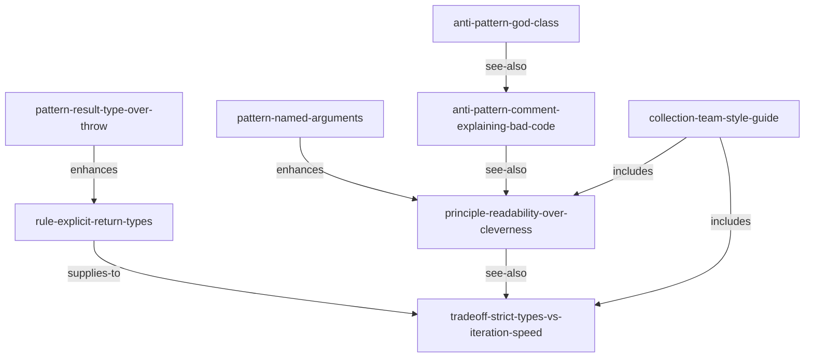

# Coding Style — 团队代码规范语料库

> 12 个原子，将 TypeScript 团队的代码风格策略编码为 Skill Wiki 语料库。

这个语料库回答了一个常见问题：*能把团队的工程规范编码为 Skill Wiki 原子，提供给 AI 编程助手使用吗？*

答案是可以的。这个语料库模拟了一个假设的 TypeScript 团队风格指南——
4 条强制规则、3 种推荐模式、2 个主动反模式、1 条原则、1 个合集，
以及 1 个明确的权衡。

---

## 为什么要有这个语料库

它展示两件事：

1. **机构知识变原子**。`.eslintrc` 强制执行规则，但不解释*为什么*这样做。
   Skill Wiki 语料库为每条规则提供 `description`、`notes` 以及与其相关规则的边。
   AI 编程助手可以在真正需要时按需加载相关子集——而不是每次都加载完整的风格指南。

2. **`tradeoff` 种类**。真实的工程决策涉及真实的张力，而不只是正确答案。
   这个语料库有一个 `tradeoff` 原子（`strict-types-vs-iteration-speed`），
   诚实地呈现了两面，因为一个不了解权衡的 AI 代理会不分场合地以同样方式解决它。

---

## 原子目录

### Rules — 由 ESLint / CI 强制执行

| 原子 ID | 摘要 |
|---|---|
| `@team/rule-no-default-export` | 所有导出必须是具名导出，禁止 `export default`。 |
| `@team/rule-explicit-return-types` | 导出函数必须有显式返回类型注解。 |
| `@team/rule-no-magic-numbers` | 超出 0 和 1 的数字字面量必须命名为常量。 |
| `@team/rule-test-each-public-fn` | 每个导出函数必须至少有一个测试用例。 |

### Patterns — 推荐解决方案

| 原子 ID | 摘要 |
|---|---|
| `@team/pattern-result-type-over-throw` | 预期失败返回 `Result<T, E>` 而不是抛出异常。 |
| `@team/pattern-builder-over-options-bag` | 构造函数参数超过 4 个时使用链式 Builder。 |
| `@team/pattern-named-arguments` | 使用具名参数对象代替位置参数。 |

### Anti-patterns — 代码评审中主动标记的错误

| 原子 ID | 摘要 |
|---|---|
| `@team/anti-pattern-god-class` | 职责过多的类；违反单一职责原则。 |
| `@team/anti-pattern-comment-explaining-bad-code` | 用注释解释坏代码做什么，而不是重写它。 |

### Principle — 根本性启发

| 原子 ID | 摘要 |
|---|---|
| `@team/principle-readability-over-cleverness` | 为 6 个月后的维护者而优化，而不是为今天的作者。 |

### Tradeoff — 明确的张力

| 原子 ID | 摘要 |
|---|---|
| `@team/tradeoff-strict-types-vs-iteration-speed` | 严格 TypeScript 与迭代速度的权衡；何时强制，何时延迟。 |

### Collection — 打包合集

| 原子 ID | 摘要 |
|---|---|
| `@team/collection-team-style-guide` | 将以上 11 个原子打包为一个可安装的风格指南。 |

---

## 原子关系图



原则是根节点；权衡是对原则有局限性的诚实承认。
每条规则和模式都指向原则作为其理由。

---

## 如何编译

```bash
cd examples/coding-style
prime compile primes/sources --out primes/compiled
# [build] parsing 12 .prime files...
# [build] resolving edges... 25 edges across 12 atoms
# [build] L1 checks: PASS
# done in ~100ms
```

---

## 如何查询

**获取整个合集：**

```bash
prime show @team/collection-team-style-guide --level full
```

**查询 5 个参数的构造函数应用什么模式：**

```bash
prime query "constructor with many parameters" --kind pattern
# matched: @team/pattern-builder-over-options-bag (full)
```

**获取关于严格类型的权衡分析：**

```bash
prime show @team/tradeoff-strict-types-vs-iteration-speed --level full
```

---

## 将此作为团队模板

这个语料库有意精简——12 个原子涵盖最常被违反的规则。
要适配到你的团队：

1. 复制 `primes/sources/@team/` 目录。
2. 将 `@team` 更改为你的组织命名空间（例如 `@acme`、`@myteam`）。
3. 添加或删除原子以匹配你的实际 `.eslintrc`。
4. 更新 `collection-team-style-guide` 以包含/排除原子。
5. 编译并服务。

原子与你的 linter 共存——linter 强制执行，原子*解释*并告知
AI 助手*为什么*这样做。

---

## 下一步

- **创作指南**：[`docs/corpus-authoring.md`](../../docs/corpus-authoring.md)
- **最小示例**：[`../hello-world/`](../hello-world/) — 5 个原子，冒烟测试
- **跨领域示例**：[`../recipes/`](../recipes/) — 15 个原子，烹饪领域
