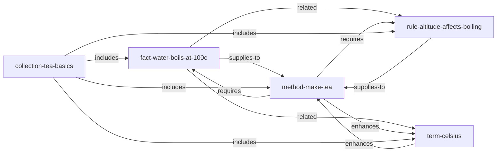

# Hello World — Tea Basics

> Five atoms. One method. The smoke test for any Skill Wiki installation.

This corpus contains the smallest meaningful demonstration of the Skill Wiki / Prime DSL:
enough thermophysics to brew a correct cup of tea anywhere in the world.
Read it in two minutes; compile it in one command; then throw it away and write your own.

---

## Why this corpus exists

It answers one question: **does my setup work?**

Five atoms, seven edges, one compile command. If that works, your parser, compiler, and
runtime are all operational. Everything else is domain knowledge layered on top of the
same protocol.

A secondary goal: show every learner that Skill Wiki is **not** about frontend design.
These atoms are physics and cooking. The DSL, edge verbs, and projection levels are
identical to what the 899-atom frontend corpus uses.

---

## Atom catalog

| Atom ID | Kind | Summary |
|---|---|---|
| `@example/fact-water-boils-at-100c` | `fact` | Pure water boils at 100°C at 1 atm (NIST). |
| `@example/term-celsius` | `term` | The Celsius temperature scale — 0°C freezing, 100°C boiling. |
| `@example/rule-altitude-affects-boiling` | `rule` | Above 1500m, boiling point drops below 96°C; allow longer steep. |
| `@example/method-make-tea` | `method` | Heat water to correct temperature, steep by tea type, strain. |
| `@example/collection-tea-basics` | `collection` | Bundles all four atoms above into one installable unit. |

---

## Atom graph



The graph has a single sink (`method-make-tea`) and a single bundle (`collection-tea-basics`).
Traversing `requires` edges from the method pulls in exactly the atoms needed to execute it.

---

## How to compile

From the repo root:

```bash
cd examples/hello-world
prime compile primes/sources --out primes/compiled
# [build] parsing 5 .prime files...
# [build] resolving edges... 7 edges across 5 atoms
# [build] L1 checks: PASS
# [build] emitted 5 atom dirs to primes/compiled
# done in ~80ms
```

Or with `bun` directly:

```bash
bun scripts/build-atom-dirs.ts --src primes/sources --out primes/compiled
```

Check what was compiled:

```bash
prime ls
# @example/collection-tea-basics     collection  "Bundles the four atoms above into one installable unit."
# @example/fact-water-boils-at-100c  fact        "Pure water boils at 100°C at 1 atm"
# @example/method-make-tea           method      "Heat water, steep leaves, strain"
# @example/rule-altitude-affects-boiling  rule   "Boiling point drops ~0.5°C per 150m elevation"
# @example/term-celsius              term        "The Celsius temperature scale"
```

---

## How to query

**Show a specific atom** at full projection:

```bash
prime show @example/method-make-tea
```

**Show only the summary** (index level):

```bash
prime show @example/method-make-tea --level summary
```

**Traverse the graph** — what does `method-make-tea` depend on?

```bash
prime deps @example/method-make-tea
# requires: @example/fact-water-boils-at-100c
# requires: @example/rule-altitude-affects-boiling
```

**Explore neighbors**:

```bash
prime graph @example/fact-water-boils-at-100c --depth 1
# → @example/term-celsius           (related)
# → @example/rule-altitude-affects-boiling (related)
# → @example/method-make-tea        (supplies-to)
```

---

## Via the MCP server

Boot the generic MCP server against this corpus:

```bash
PRIME_DIR=$(pwd)/primes/compiled bun ../../packages/mcp-server-core/src/index.ts
# [prime-mcp-core] 5 atoms · 348 tokens · 1 clusters
# [prime-mcp-core] ready · tool: prime_query · stdio transport active
```

Wire it into Claude Code (`.claude/mcp-servers.json`):

```json
{
  "mcpServers": {
    "tea-basics": {
      "command": "prime",
      "args": ["mcp", "serve", "--corpus", "/abs/path/to/hello-world/primes/compiled"]
    }
  }
}
```

Then in a conversation, the agent can call:

```
prime_query({ scope: "atoms", query: "how do I make tea", level: "full" })
```

The runtime returns `method-make-tea` at full projection, plus its `requires` edges resolved
to `fact-water-boils-at-100c` and `rule-altitude-affects-boiling` at `core` projection.

---

## Three projection levels

Every atom is loadable at three detail levels:

| Level | Typical size | When used |
|---|---|---|
| `summary` | ~30 tokens | Always in the index — the agent always sees this |
| `core` | ~150 tokens | When retrieval picks the atom as adjacent / supporting |
| `full` | ~400 tokens | When retrieval picks it as the primary answer |

The agent never loads the full corpus. It sees the ~800-byte summary index for this corpus
and decides which atoms to expand.

---

## Next steps

You've verified the round-trip works. Now write your own corpus.

- **Authoring guide**: [`docs/corpus-authoring.md`](../../docs/corpus-authoring.md)
- **DSL quick reference**: [`docs/dsl-quickref.md`](../../docs/dsl-quickref.md)
- **Larger example**: [`../recipes/`](../recipes/) — 15 atoms across cooking knowledge
- **Domain-specific example**: [`../coding-style/`](../coding-style/) — 12 atoms as team lint rules
