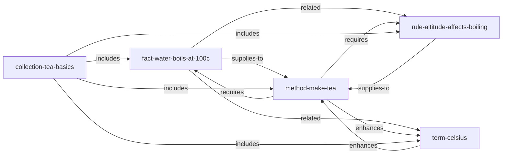

# Hello World — 泡茶基础

> 5 个原子，1 个方法，验证 AOE 安装是否正常的冒烟测试。

这个语料库是 AOE / AOE DSL 最小的可运行示例：
用热力学知识在世界任何地方泡出一杯正确的茶。
两分钟读完，一条命令编译，然后扔掉它，写属于你自己的语料库。

---

## 为什么要有这个语料库

它只回答一个问题：**我的 AOE 环境装好了吗？**

5 个原子，7 条边，1 条编译命令。能跑通，说明 parser、compiler、runtime 全部正常。
其他一切都是在相同协议上叠加的领域知识。

第二个目标：让所有初学者看到 AOE **不仅仅用于前端设计**。
这些原子是物理和烹饪领域的——但使用的 DSL、边动词和投影级别与 899 个原子的前端语料库完全相同。

---

## 原子目录

| 原子 ID | 种类 | 摘要 |
|---|---|---|
| `@example/fact-water-boils-at-100c` | `fact` | 纯水在 1 atm 下 100°C 沸腾（NIST）。 |
| `@example/term-celsius` | `term` | 摄氏温标 — 0°C 为冰点，100°C 为沸点。 |
| `@example/rule-altitude-affects-boiling` | `rule` | 海拔超过 1500m 时，沸点低于 96°C，需延长浸泡时间。 |
| `@example/method-make-tea` | `method` | 将水加热至正确温度，按茶叶类型浸泡，过滤后饮用。 |
| `@example/collection-tea-basics` | `collection` | 将以上 4 个原子打包为一个可安装的单元。 |

---

## 原子关系图



图有唯一的汇聚点（`method-make-tea`）和唯一的打包节点（`collection-tea-basics`）。
沿 `requires` 边从方法出发，恰好能拉取执行该方法所需的全部原子。

---

## 如何编译

从仓库根目录：

```bash
cd examples/hello-world
aoe compile primes/sources --out primes/compiled
# [build] parsing 5 .prime files...
# [build] resolving edges... 7 edges across 5 atoms
# [build] L1 checks: PASS
# [build] emitted 5 atom dirs to primes/compiled
# done in ~80ms
```

或直接用 `bun`：

```bash
bun scripts/build-atom-dirs.ts --src primes/sources --out primes/compiled
```

查看编译结果：

```bash
aoe ls
# @example/collection-tea-basics         collection  "..."
# @example/fact-water-boils-at-100c      fact        "..."
# @example/method-make-tea               method      "..."
# @example/rule-altitude-affects-boiling rule        "..."
# @example/term-celsius                  term        "..."
```

---

## 如何查询

**查看某个原子**（完整投影）：

```bash
aoe show @example/method-make-tea
```

**仅查看摘要**（索引级别）：

```bash
aoe show @example/method-make-tea --level summary
```

**查看依赖闭包**：

```bash
aoe deps @example/method-make-tea
# requires: @example/fact-water-boils-at-100c
# requires: @example/rule-altitude-affects-boiling
```

---

## 通过 MCP 服务器查询

启动通用 MCP 服务器：

```bash
AOE_CORPUS_DIR=$(pwd)/primes/compiled bun ../../packages/mcp-server-core/src/index.ts
# [aoe-mcp-core] 5 atoms · 348 tokens · 1 clusters
# [aoe-mcp-core] ready · tool: aoe_query · stdio transport active
```

接入 Claude Code（`.claude/mcp-servers.json`）：

```json
{
  "mcpServers": {
    "tea-basics": {
      "command": "aoe",
      "args": ["mcp", "serve", "--corpus", "/绝对路径/hello-world/primes/compiled"]
    }
  }
}
```

---

## 三个投影级别

每个原子都可以按三个细节级别加载：

| 级别 | 典型大小 | 使用时机 |
|---|---|---|
| `summary` | ~30 tokens | 始终在索引中，Agent 每次都能看到 |
| `core` | ~150 tokens | 检索将该原子选为相邻 / 支撑信息时 |
| `full` | ~400 tokens | 检索将该原子选为主要答案时 |

Agent 永远不会加载完整语料库。它看到的是约 800 字节的摘要索引，然后决定展开哪些原子。

---

## 下一步

冒烟测试通过了？现在写你自己的语料库。

- **创作指南**：[`docs/corpus-authoring.md`](../../docs/corpus-authoring.md)
- **DSL 速查表**：[`docs/dsl-quickref.md`](../../docs/dsl-quickref.md)
- **进阶示例**：[`../recipes/`](../recipes/) — 15 个原子，烹饪领域
- **团队规范示例**：[`../coding-style/`](../coding-style/) — 12 个原子，团队代码风格
