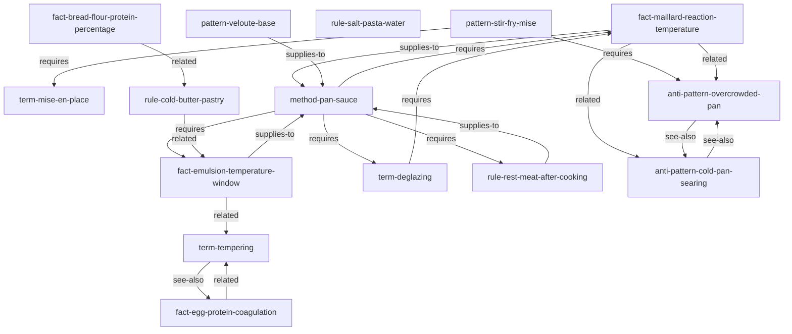

# Recipes — Cooking Knowledge Corpus

> Fifteen atoms across eight kinds. Proof that Skill Wiki works for any domain.

This corpus encodes practical cooking knowledge as typed atoms with a real edge graph.
It is deliberately cross-domain from the frontend corpus — the same DSL, same edge verbs,
same projection levels, entirely different subject matter.

---

## Why this corpus exists

It teaches two things:

1. **Protocol applied to cooking.** The 28 atom kinds and 14 edge verbs structure cooking
   knowledge the same way they structure any other domain. `fact`, `term`, `rule`, `pattern`,
   `anti-pattern`, and `method` express culinary knowledge without any protocol changes.

2. **Graph density.** Fifteen atoms with ~30 edges show how a real corpus forms a graph
   rather than a flat list. Atoms reference each other across kinds. A `method` `requires`
   `facts` and `terms`. A `pattern` `supplies-to` a `method`. An `anti-pattern` has a
   `see-also` pointing at the pattern that replaces it.

If you're authoring a corpus in a new domain — security, legal, finance, HR, devops — this
is the most useful reference.

---

## Atom catalog

### Facts — empirical claims with sources

| Atom ID | Summary |
|---|---|
| `@recipes/fact-maillard-reaction-temperature` | Maillard browning begins at ~140°C, peaks 150–180°C. |
| `@recipes/fact-egg-protein-coagulation` | Egg white sets at 60–80°C; yolk at 65–70°C. |
| `@recipes/fact-bread-flour-protein-percentage` | Bread flour 12–14% protein vs all-purpose 10–12%. |
| `@recipes/fact-emulsion-temperature-window` | Butter emulsion stable at 60–70°C; breaks above 80°C. |

### Terms — defined concepts

| Atom ID | Summary |
|---|---|
| `@recipes/term-mise-en-place` | "Everything in its place" — prep all ingredients before cooking begins. |
| `@recipes/term-deglazing` | Adding liquid to a hot pan to dissolve caramelized fond. |
| `@recipes/term-tempering` | Gradually raising temperature to prevent shock-curdling. |

### Rules — prescriptive constraints

| Atom ID | Summary |
|---|---|
| `@recipes/rule-salt-pasta-water` | Salt pasta water to ~1–2% before adding pasta. |
| `@recipes/rule-rest-meat-after-cooking` | Rest meat before slicing; 5–30 min depending on size. |
| `@recipes/rule-cold-butter-pastry` | Keep butter below 32°C throughout pastry mixing. |

### Patterns — reusable solutions

| Atom ID | Summary |
|---|---|
| `@recipes/pattern-veloute-base` | Roux + stock = mother sauce; basis for pan sauces and cream sauces. |
| `@recipes/pattern-stir-fry-mise` | Full mise en place before wok, then 5-step cook sequence. |

### Anti-patterns — mistakes to avoid

| Atom ID | Summary |
|---|---|
| `@recipes/anti-pattern-overcrowded-pan` | Too much food → steam instead of sear → grey, wet results. |
| `@recipes/anti-pattern-cold-pan-searing` | Cold pan → food sticks and steams rather than sears. |

### Methods — multi-step procedures

| Atom ID | Summary |
|---|---|
| `@recipes/method-pan-sauce` | Sear protein, deglaze fond, reduce, mount butter — 10-minute sauce. |

---

## Atom graph



The `method-pan-sauce` is the hub of this corpus — it pulls in 4 `requires` edges,
making it a good entry point for graph traversal.

---

## How to compile

```bash
cd examples/recipes
prime compile primes/sources --out primes/compiled
# [build] parsing 15 .prime files...
# [build] resolving edges... 31 edges across 15 atoms
# [build] L1 checks: PASS
# [build] emitted 15 atom dirs to primes/compiled
# done in ~120ms
```

List by kind:

```bash
prime ls --kind fact
prime ls --kind rule
prime ls --kind method
```

---

## How to query

**Get the pan sauce method in full:**

```bash
prime show @recipes/method-pan-sauce --level full
```

**Traverse what method-pan-sauce depends on:**

```bash
prime deps @recipes/method-pan-sauce
# requires: @recipes/fact-maillard-reaction-temperature
# requires: @recipes/fact-emulsion-temperature-window
# requires: @recipes/rule-rest-meat-after-cooking
# requires: @recipes/term-deglazing
```

**Find the anti-pattern for a given mistake:**

```bash
prime query "pan too crowded" --kind anti-pattern
# matched: @recipes/anti-pattern-overcrowded-pan (full)
```

**Boot the MCP server:**

```bash
PRIME_DIR=$(pwd)/primes/compiled bun ../../packages/mcp-server-core/src/index.ts
# [prime-mcp-core] 15 atoms · ... tokens · ... clusters
# [prime-mcp-core] ready · tool: prime_query · stdio transport active
```

---

## What this corpus teaches about graph design

A few patterns worth noticing:

- **Asymmetric edges**: `fact-maillard-reaction-temperature` has `supplies-to` pointing at
  `method-pan-sauce`, and the method has `requires` pointing back. These two verbs are
  semantically paired but declared independently on each atom — the compiler resolves them
  into a single bidirectional edge in `graph.yaml`.

- **Anti-patterns point at each other**: `overcrowded-pan` and `cold-pan-searing` share a
  `see-also` edge because they are commonly co-occurring mistakes. The `see-also` verb is
  purely informational — the retriever uses it for neighborhood expansion, not for
  constraint checking.

- **Rules are not methods**: `rule-rest-meat-after-cooking` is prescriptive ("always do X");
  `method-pan-sauce` is procedural ("here is how"). The method `requires` the rule — meaning
  the rule must be loaded when the method is loaded, because the method's steps reference it.

---

## Next steps

- **Authoring guide**: [`docs/corpus-authoring.md`](../../docs/corpus-authoring.md)
- **Smaller example**: [`../hello-world/`](../hello-world/) — 5 atoms, the smoke test
- **Code-style example**: [`../coding-style/`](../coding-style/) — 12 atoms, team rules
