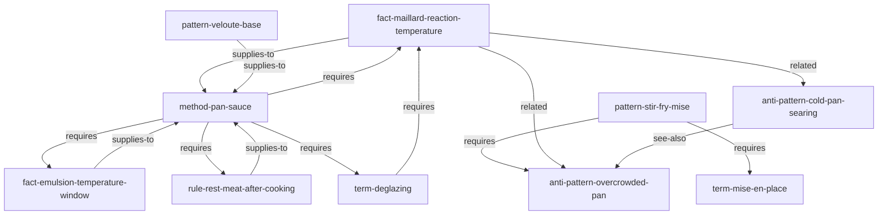

# Recipes — 烹饪知识语料库

> 15 个原子，8 种类型，证明 AOE 适用于任何领域。

这个语料库将实用烹饪知识编码为带有真实边图的类型化原子。
它与前端语料库有意地跨越不同领域——相同的 DSL，相同的边动词，
相同的投影级别，完全不同的主题。

---

## 为什么要有这个语料库

它教会读者两件事：

1. **协议应用于烹饪**。28 种原子类型和 14 个边动词以相同方式结构化烹饪知识。
   `fact`、`term`、`rule`、`pattern`、`anti-pattern`、`method` 在不修改协议的情况下表达烹饪知识。

2. **图的密度**。15 个原子约 30 条边展示了真实语料库如何形成图而不是平铺列表。
   原子跨种类互相引用。`method` `requires` `facts` 和 `terms`。`pattern` `supplies-to` 某个 `method`。
   `anti-pattern` 有 `see-also` 指向替代它的 `pattern`。

如果你要在新领域（安全、法律、金融、人力资源、运维）创作语料库，这是最实用的参考。

---

## 原子目录

### Facts — 有来源的经验性陈述

| 原子 ID | 摘要 |
|---|---|
| `@recipes/fact-maillard-reaction-temperature` | 美拉德褐变从约 140°C 开始，在 150–180°C 加速。 |
| `@recipes/fact-egg-protein-coagulation` | 蛋白在 60–80°C 凝固；蛋黄在 65–70°C 凝固。 |
| `@recipes/fact-bread-flour-protein-percentage` | 面包粉蛋白质 12–14%，中筋面粉 10–12%。 |
| `@recipes/fact-emulsion-temperature-window` | 黄油乳化在 60–70°C 稳定，超过 80°C 则分离。 |

### Terms — 定义的概念

| 原子 ID | 摘要 |
|---|---|
| `@recipes/term-mise-en-place` | "各就各位" — 开始烹饪前备好所有食材。 |
| `@recipes/term-deglazing` | 向热锅中加液体以溶解焦化的锅底精华（fond）。 |
| `@recipes/term-tempering` | 逐步升温以防止骤冷导致蛋白质凝结或乳化破坏。 |

### Rules — 规定性约束

| 原子 ID | 摘要 |
|---|---|
| `@recipes/rule-salt-pasta-water` | 下面前将意大利面水盐化至约 1–2%。 |
| `@recipes/rule-rest-meat-after-cooking` | 切割前醒肉；根据大小醒 5–30 分钟。 |
| `@recipes/rule-cold-butter-pastry` | 制作酥皮时保持黄油温度低于 32°C。 |

### Patterns — 可复用的解决方案

| 原子 ID | 摘要 |
|---|---|
| `@recipes/pattern-veloute-base` | 黄油面糊 + 高汤 = 母酱；锅底酱和奶油酱的基础。 |
| `@recipes/pattern-stir-fry-mise` | 炒锅前完成全部备料，然后执行 5 步烹饪流程。 |

### Anti-patterns — 需要避免的错误

| 原子 ID | 摘要 |
|---|---|
| `@recipes/anti-pattern-overcrowded-pan` | 食材过多 → 蒸而非煎 → 灰色湿润的结果。 |
| `@recipes/anti-pattern-cold-pan-searing` | 冷锅 → 食材粘锅，蒸而不是煎。 |

### Methods — 多步骤流程

| 原子 ID | 摘要 |
|---|---|
| `@recipes/method-pan-sauce` | 煎肉 → 烹汁溶底 → 收汁 → 黄油收尾，10 分钟做出锅底酱。 |

---

## 原子关系图



`method-pan-sauce` 是本语料库的枢纽节点——它包含 4 条 `requires` 边，
是图遍历的最佳起点。

---

## 如何编译

```bash
cd examples/recipes
aoe compile primes/sources --out primes/compiled
# [build] parsing 15 .prime files...
# [build] resolving edges... 31 edges across 15 atoms
# [build] L1 checks: PASS
# done in ~120ms
```

按种类列出：

```bash
aoe ls --kind fact
aoe ls --kind rule
aoe ls --kind method
```

---

## 如何查询

**获取锅底酱方法（完整投影）：**

```bash
aoe show @recipes/method-pan-sauce --level full
```

**遍历依赖：**

```bash
aoe deps @recipes/method-pan-sauce
# requires: @recipes/fact-maillard-reaction-temperature
# requires: @recipes/fact-emulsion-temperature-window
# requires: @recipes/rule-rest-meat-after-cooking
# requires: @recipes/term-deglazing
```

---

## 下一步

- **创作指南**：[`docs/corpus-authoring.md`](../../docs/corpus-authoring.md)
- **更小的示例**：[`../hello-world/`](../hello-world/) — 5 个原子，冒烟测试
- **代码风格示例**：[`../coding-style/`](../coding-style/) — 12 个原子，团队规范
